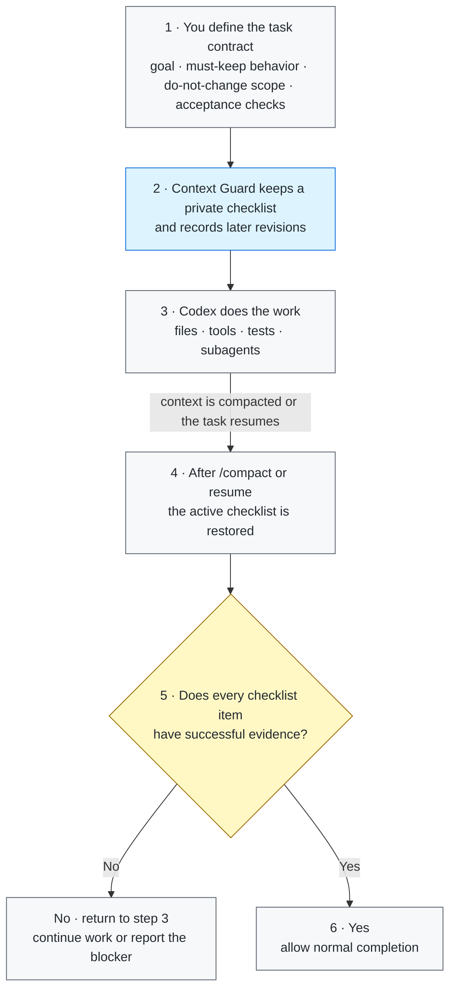

# Context Guard

[](https://github.com/GreenLv/codex-context-guard/actions/workflows/ci.yml)
[](https://github.com/GreenLv/codex-context-guard/actions/workflows/hol-plugin-scanner.yml)
[](https://github.com/GreenLv/codex-context-guard/releases)
[](LICENSE)

[简体中文](README.zh-CN.md)

Context Guard is a local correctness sidecar for long-running Codex tasks. It
keeps authoritative requirements, acceptance criteria, revisions, bounded
native-plan state, delegated-agent provenance, and verification evidence in a
private local ledger so that compaction does not silently erase the task
contract.

It does **not** replace Codex compaction, Plan or Goal mode, memories,
subagents, worktrees, or the transcript. Codex owns those systems; Context
Guard adds a bounded recovery and completion-verification layer beside them.

> Release status: `0.4.13` prevents status-only replies from being mistaken for
> whole-task completion when work is pending external review, explicitly paused,
> or intentionally unchanged. Assistant-owned follow-up work still remains gated.

### 30-second sanitized compact/recovery demo

```text
1. Activate Context Guard for a synthetic task with two requirements.
2. Continue normal work, then run /compact.
3. The resumed task receives the same bounded requirement checklist.
4. Completion remains blocked until successful evidence covers both items.
```

The demo contains no real prompts, local paths, task state, or plugin data.

## Why it exists

A long task can survive compaction while still losing the details that matter
most: an original prohibition, a later correction, an acceptance criterion, or
the fact that a local test did not verify the whole task. A normal summary is
useful context, but it is not an immutable task contract.

Context Guard therefore separates four things:

1. what the user required;
2. what later revisions explicitly superseded;
3. what tools actually produced and whether that outcome was successful;
4. what may safely be claimed complete.

## Core behavior

- Journals root and delegated prompts with SHA-256-bound metadata.
- Assigns stable requirement and acceptance IDs and records explicit
  supersessions without silently rewriting history.
- Saves a bounded recovery packet before compaction and restores it on compact
  or resume.
- Mirrors the latest successful native `update_plan` call as a read-only
  recovery index.
- Records bounded, provenance-aware delegated-agent contracts and results, not
  transcripts or hidden reasoning.
- Treats unstructured or ambiguous tool output as unknown and prevents it from
  satisfying completion gates.
- Treats explicit waiting for user approval, authorization, confirmation, or a
  decision as an incomplete state, even when the reply also reports a finished
  local milestone.
- Treats submitted-and-pending external reviews, explicit policy holds, and
  no-new-mutation status reports as incomplete turn boundaries, while keeping
  agent-owned publication or repository follow-ups behind the completion gate.
- Serializes concurrent session updates with a bounded cross-platform file
  lock, including the Windows access-denied/holder-exit race observed in CI.
- Replaces binary/data-URL payloads with bounded type, length, and hash
  metadata.
- Verifies private-state integrity and reconstructs only from hash-verified
  immutable prompt records; unrecoverable state fails closed.
- Supports redacted handoff exports and explicit, bounded successor packs.

## Architecture



Codex still owns the work, compaction, Plan/Goal state, and subagents. Context
Guard carries only the bounded correctness checklist across the context
boundary and checks it before a completion claim is accepted.

See [Architecture](docs/ARCHITECTURE.md) and
[Privacy](docs/PRIVACY.md) for the full boundary.

## Everyday example: refactor code without breaking callers

Imagine a repository exposes `submit_order(payload)` to several existing
callers. You ask Codex to clean up an increasingly hard-to-maintain checkout
module.

### 1. Initial request

```text
Refactor checkout validation out of checkout.py into validators.py.

Requirements:
- Keep the public submit_order(payload) signature and behavior unchanged.
- Do not add or edit database migrations.
- Add regression tests for invalid coupons and duplicate orders.
- Finish only when the existing and new tests pass.
```

Context Guard turns those requirements into a private checklist. Codex remains
free to inspect files, make a plan, edit code, run tools, or delegate bounded
subtasks normally.

### 2. A later correction

```text
One more constraint: keep normalize_phone() as a compatibility wrapper because
an older integration still imports it directly.
```

The correction is appended to the checklist; it does not silently rewrite the
original request.

### 3. The task becomes long and `/compact` runs

After many file reads, edits, test failures, and fixes, the conversation is
compacted. A normal summary might remember “move validation and make tests
pass” while dropping the compatibility wrapper or migration prohibition.
Context Guard restores the active checklist instead:

```text
Still required after compaction:
- submit_order(payload) remains compatible with existing callers.
- Database migrations remain untouched.
- normalize_phone() remains as a compatibility wrapper.
- Invalid-coupon and duplicate-order regressions exist.
- Existing and new tests must pass before completion.
```

### 4. “The refactor is done” is checked against evidence

Before Codex can finish, each open item still needs captured successful
evidence:

| Checklist item | Example evidence | If evidence is missing |
| --- | --- | --- |
| Public API unchanged | signature/contract inspection and compatibility tests | continue working |
| No migration changes | a successful diff check over the migration directory | continue working |
| Wrapper preserved | implementation inspection plus its regression test | continue working |
| Required behavior covered | invalid-coupon and duplicate-order tests exist | continue working |
| Refactor passes | existing and new test suites exit successfully | allow completion |

The final reply can then say what changed and cite the checks that passed,
without relying on the post-compaction summary to remember every constraint.

This is a representative refactoring case, not a benchmark or a claim of
semantic proof. Context Guard ensures that requirements remain visible and
that completion is evidence-bound; humans and tests still decide whether the
implementation is actually correct.

## Requirements

- Python 3.10 or newer. The Hook runtime has no third-party dependencies.
- Codex CLI `0.146.0` or newer as the tested minimum baseline. This is a tested
  lower bound, not a promise of compatibility with every future Codex version.
- A supported Codex surface that loads plugins and lifecycle Hooks.

## Install from a local clone

Install from the public GitHub repository:

```shell
git clone https://github.com/GreenLv/codex-context-guard.git
cd codex-context-guard
python3 scripts/manage_plugin.py --apply
```

On Windows, use a Python 3.10+ launcher:

```powershell
py -3.10 scripts\manage_plugin.py --apply
```

The helper registers this non-default repository marketplace, installs
`context-guard@codex-context-guard`, verifies source/cache parity, and preserves
older versioned caches during upgrades. It refuses to refresh changed source
under the same version because an active task may still execute the old
absolute Hook cache path.

Installing a plugin does not automatically trust its Hooks. Start a fresh
Codex CLI task, open `/hooks`, inspect the eight definitions, and trust them
only if they match this repository. Do not use a trust-bypass flag. Start
another fresh task after installation or Hook changes.

Related official documentation: [package a plugin](https://developers.openai.com/plugins/build/plugins),
[install and use plugins](https://learn.chatgpt.com/docs/plugins), and
[advanced Hook configuration](https://learn.chatgpt.com/docs/config-file/config-advanced#hooks).

## Quick check

In a fresh task:

```text
$context-guard
```

Then run:

```text
context-guard status
```

For a recovery smoke test, start a non-trivial task, use `/compact`, and confirm
that the immediate continuation contains a bounded recovery packet with the
same requirements. A successful local unit test is not by itself proof that a
real compact/resume path worked.

Maintainers can run the isolated installed lifecycle smoke against an installed
cache:

```shell
python3 scripts/smoke_installed.py
```

## User controls

- `$context-guard` or `context-guard on` activates full recovery and completion
  gating.
- `context-guard off` disables recovery and completion gating while preserving
  prompt journaling.
- `context-guard status` reports protected-state counts without exposing raw
  prompts.
- `context-guard export <path>` writes a redacted handoff inside the current
  project. The default is `.codex/context-guard/CONTEXT_HANDOFF.md`.
- `context-guard rollover <directory>` validates an explicitly prepared
  successor input and writes a non-overwriting bounded handoff plus hash
  manifest. It never creates or authorizes another task.

Read [Successor Pack Input](skills/context-guard/references/successor-pack.md)
before using `rollover`.

## Private data and retention

Plugin runtime data is written under Codex-managed `PLUGIN_DATA`. The direct
CLI fallback exists for isolated development only. Prompt bodies, task state,
evidence summaries, and recovery files are local runtime data and are not part
of this repository.

Ended sessions are eligible for cleanup after 30 days. Redacted exports are
created only when explicitly requested and remain in the selected project, so
the user controls their retention. Never commit plugin data or generated
`.codex/context-guard/` files without reviewing the export.

Exports omit raw prompt files, transcript content, credentials, authorization
headers, URL query values, and plugin-private paths. See
[Privacy](docs/PRIVACY.md).

## Update and uninstall

To update a local clone:

```shell
git pull --ff-only
python3 scripts/manage_plugin.py --apply
```

Plugin source changes require a version bump. The helper preserves prior
versioned caches so already-running tasks can finish on the code they loaded.

To uninstall the public plugin and marketplace:

```shell
codex plugin remove context-guard@codex-context-guard
codex plugin marketplace remove codex-context-guard
```

Uninstalling code does not imply deleting private runtime state. Review the
installed plugin's data location before removing it, and retain it if an active
task may still depend on the old Hook path.

## Validation

```shell
python3 scripts/validate_public_repo.py .
python3 scripts/audit_public_tree.py .
python3 -m unittest discover -s tests -p "test_*.py"
ruff check .
```

Repository validation tools are pinned in `requirements-lock.txt`. The Hook
runtime remains standard-library-only and has no third-party dependencies.

The CI matrix covers Ubuntu, macOS, and Windows with Python 3.10, 3.12, and
3.13. Platform claims remain evidence-bounded; see
[Compatibility](docs/COMPATIBILITY.md).

The current native Windows follow-up covers the automated suite, an isolated
installed lifecycle, and the normal persistent trust flow for a fresh Hook
task. With the Windows trust root supplied to the isolated CLI through
`CODEX_CA_CERTIFICATE`, a real manual `/compact` completed backend compaction,
ran `PreCompact`, injected the recovery packet through `SessionStart`, and
recovered both exact markers in a blind post-compact prompt. See
[Local release acceptance](docs/LOCAL_ACCEPTANCE.md) for the full evidence.

## Explicit non-goals

Context Guard is not:

- a semantic proof that the implementation is correct;
- a general security sandbox or access-control system;
- a transcript backup or cloud synchronization service;
- a second Plan/Goal controller, agent scheduler, mailbox, or shared workspace;
- a replacement for human review, tests, or acceptance.

Semantic evidence matching, shared multi-agent workspaces, and telemetry are
not committed roadmap items. They require a reproducible failure or a separate,
approved benchmark-first plan.

## Contributing and security

See [CONTRIBUTING.md](CONTRIBUTING.md) for development rules. Report sensitive
issues through GitHub Private Vulnerability Reporting as described in
[SECURITY.md](SECURITY.md).

Licensed under the [Apache License 2.0](LICENSE).
