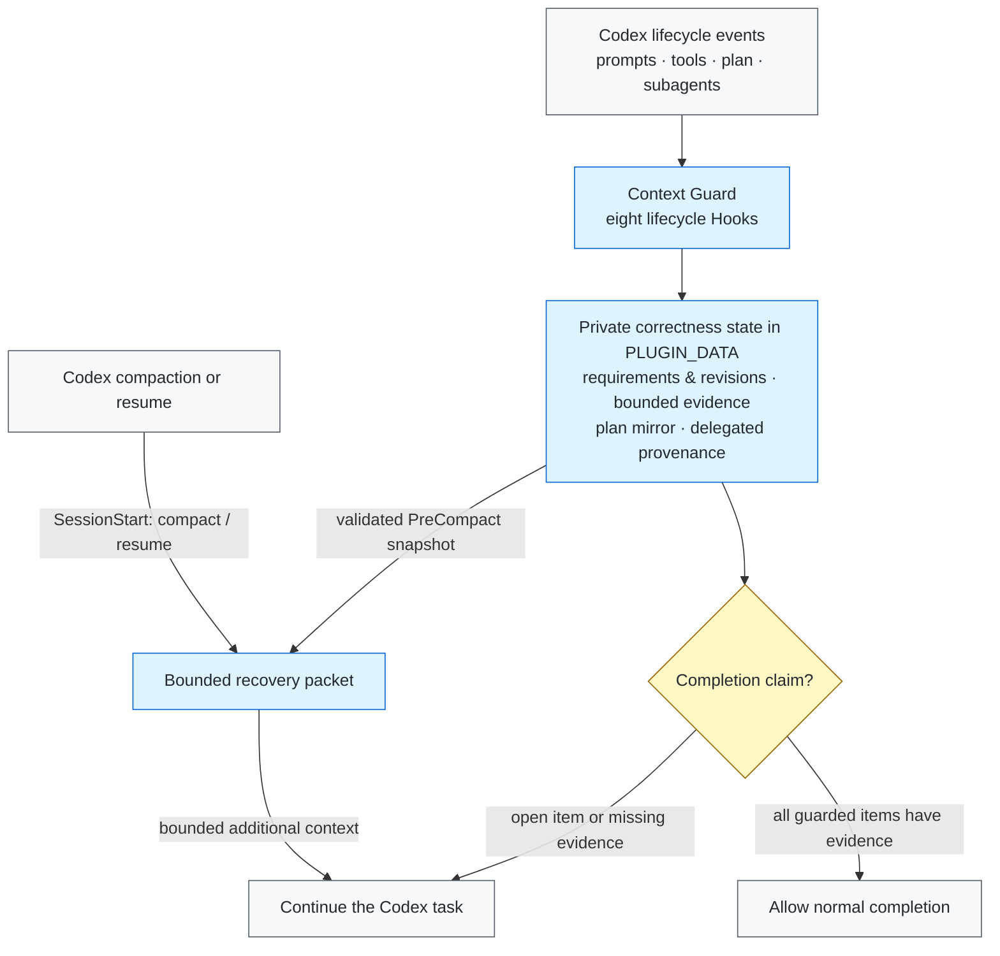

# Context Guard

[简体中文](README.zh-CN.md)

Context Guard is a local correctness sidecar for long-running Codex tasks. It
keeps authoritative requirements, acceptance criteria, revisions, bounded
native-plan state, delegated-agent provenance, and verification evidence in a
private local ledger so that compaction does not silently erase the task
contract.

It does **not** replace Codex compaction, Plan or Goal mode, memories,
subagents, worktrees, or the transcript. Codex owns those systems; Context
Guard adds a bounded recovery and completion-verification layer beside them.

> Release status: `0.4.9` is the first public release. Universal plugin-directory
> submission remains a separate, optional follow-up.

## Why it exists

A long task can survive compaction while still losing the details that matter
most: an original prohibition, a later correction, an acceptance criterion, or
the fact that a local test did not verify the whole task. A normal summary is
useful context, but it is not an immutable task contract.

Context Guard therefore separates four things:

1. what the user required;
2. what later revisions explicitly superseded;
3. what tools actually produced and whether that outcome was successful;
4. what may safely be claimed complete.

## Core behavior

- Journals root and delegated prompts with SHA-256-bound metadata.
- Assigns stable requirement and acceptance IDs and records explicit
  supersessions without silently rewriting history.
- Saves a bounded recovery packet before compaction and restores it on compact
  or resume.
- Mirrors the latest successful native `update_plan` call as a read-only
  recovery index.
- Records bounded, provenance-aware delegated-agent contracts and results, not
  transcripts or hidden reasoning.
- Treats unstructured or ambiguous tool output as unknown and prevents it from
  satisfying completion gates.
- Treats explicit waiting for user approval, authorization, confirmation, or a
  decision as an incomplete state, even when the reply also reports a finished
  local milestone.
- Serializes concurrent session updates with a bounded cross-platform file
  lock, including the Windows access-denied/holder-exit race observed in CI.
- Replaces binary/data-URL payloads with bounded type, length, and hash
  metadata.
- Verifies private-state integrity and reconstructs only from hash-verified
  immutable prompt records; unrecoverable state fails closed.
- Supports redacted handoff exports and explicit, bounded successor packs.

## Architecture



See [Architecture](docs/ARCHITECTURE.md) and
[Privacy](docs/PRIVACY.md) for the full boundary.

## What it looks like in practice

The following sanitized case is based on the real manual `/compact` acceptance
used for the first public release. It contains no private transcript, session
identifier, or plugin state.

### Task contract before compaction

```text
R1. Preserve the exact marker ALPHA-049.
R2. Preserve the exact marker BETA-READONLY.
R3. Do not modify any file.
R4. Complete only after a real /compact and a subsequent reply that reports
    both exact markers.
```

The user then runs `/compact`. On `PreCompact`, Context Guard validates its
private state and writes a bounded recovery snapshot. On
`SessionStart: compact`, it restores the active requirements and completion
rule as additional context.

### First reply after compaction

```text
Exact markers: ALPHA-049, BETA-READONLY.
No files were modified.
```

| Stage | Summary-only failure mode (illustrative, not a benchmark) | Observed with Context Guard |
| --- | --- | --- |
| Before `/compact` | Exact constraints compete with the rest of a long transcript. | Requirements receive stable IDs in the private ledger. |
| After `/compact` | A broad summary may retain “run the check” but omit a marker or prohibition. | The bounded packet restores both markers and the no-write constraint. |
| Completion | A local pass phrase may be mistaken for whole-task completion. | Completion remains gated until the guarded items have captured successful evidence. |

This demonstrates requirement retention and an evidence-bound completion
decision. It does **not** prove that arbitrary evidence is semantically
sufficient or provide a controlled comparison against every summary strategy.

## Requirements

- Python 3.10 or newer. The Hook runtime has no third-party dependencies.
- Codex CLI `0.146.0` or newer as the tested minimum baseline. This is a tested
  lower bound, not a promise of compatibility with every future Codex version.
- A supported Codex surface that loads plugins and lifecycle Hooks.

## Install from a local clone

Install from the public GitHub repository:

```shell
git clone https://github.com/GreenLv/codex-context-guard.git
cd codex-context-guard
python3 scripts/manage_plugin.py --apply
```

On Windows, use a Python 3.10+ launcher:

```powershell
py -3.10 scripts\manage_plugin.py --apply
```

The helper registers this non-default repository marketplace, installs
`context-guard@codex-context-guard`, verifies source/cache parity, and preserves
older versioned caches during upgrades. It refuses to refresh changed source
under the same version because an active task may still execute the old
absolute Hook cache path.

Installing a plugin does not automatically trust its Hooks. Start a fresh
Codex CLI task, open `/hooks`, inspect the eight definitions, and trust them
only if they match this repository. Do not use a trust-bypass flag. Start
another fresh task after installation or Hook changes.

Related official documentation: [package a plugin](https://developers.openai.com/plugins/build/plugins),
[install and use plugins](https://learn.chatgpt.com/docs/plugins), and
[advanced Hook configuration](https://learn.chatgpt.com/docs/config-file/config-advanced#hooks).

## Quick check

In a fresh task:

```text
$context-guard
```

Then run:

```text
context-guard status
```

For a recovery smoke test, start a non-trivial task, use `/compact`, and confirm
that the immediate continuation contains a bounded recovery packet with the
same requirements. A successful local unit test is not by itself proof that a
real compact/resume path worked.

Maintainers can run the isolated installed lifecycle smoke against an installed
cache:

```shell
python3 scripts/smoke_installed.py
```

## User controls

- `$context-guard` or `context-guard on` activates full recovery and completion
  gating.
- `context-guard off` disables recovery and completion gating while preserving
  prompt journaling.
- `context-guard status` reports protected-state counts without exposing raw
  prompts.
- `context-guard export <path>` writes a redacted handoff inside the current
  project. The default is `.codex/context-guard/CONTEXT_HANDOFF.md`.
- `context-guard rollover <directory>` validates an explicitly prepared
  successor input and writes a non-overwriting bounded handoff plus hash
  manifest. It never creates or authorizes another task.

Read [Successor Pack Input](skills/context-guard/references/successor-pack.md)
before using `rollover`.

## Private data and retention

Plugin runtime data is written under Codex-managed `PLUGIN_DATA`. The direct
CLI fallback exists for isolated development only. Prompt bodies, task state,
evidence summaries, and recovery files are local runtime data and are not part
of this repository.

Ended sessions are eligible for cleanup after 30 days. Redacted exports are
created only when explicitly requested and remain in the selected project, so
the user controls their retention. Never commit plugin data or generated
`.codex/context-guard/` files without reviewing the export.

Exports omit raw prompt files, transcript content, credentials, authorization
headers, URL query values, and plugin-private paths. See
[Privacy](docs/PRIVACY.md).

## Update and uninstall

To update a local clone:

```shell
git pull --ff-only
python3 scripts/manage_plugin.py --apply
```

Plugin source changes require a version bump. The helper preserves prior
versioned caches so already-running tasks can finish on the code they loaded.

To uninstall the public plugin and marketplace:

```shell
codex plugin remove context-guard@codex-context-guard
codex plugin marketplace remove codex-context-guard
```

Uninstalling code does not imply deleting private runtime state. Review the
installed plugin's data location before removing it, and retain it if an active
task may still depend on the old Hook path.

## Validation

```shell
python3 scripts/validate_public_repo.py .
python3 scripts/audit_public_tree.py .
python3 -m unittest discover -s tests -p "test_*.py"
ruff check .
```

The CI matrix covers Ubuntu, macOS, and Windows with Python 3.10, 3.12, and
3.13. Platform claims remain evidence-bounded; see
[Compatibility](docs/COMPATIBILITY.md).

## Explicit non-goals

Context Guard is not:

- a semantic proof that the implementation is correct;
- a general security sandbox or access-control system;
- a transcript backup or cloud synchronization service;
- a second Plan/Goal controller, agent scheduler, mailbox, or shared workspace;
- a replacement for human review, tests, or acceptance.

Semantic evidence matching, shared multi-agent workspaces, and telemetry are
not committed roadmap items. They require a reproducible failure or a separate,
approved benchmark-first plan.

## Contributing and security

See [CONTRIBUTING.md](CONTRIBUTING.md) for development rules. Report sensitive
issues through GitHub Private Vulnerability Reporting as described in
[SECURITY.md](SECURITY.md).

Licensed under the [Apache License 2.0](LICENSE).
