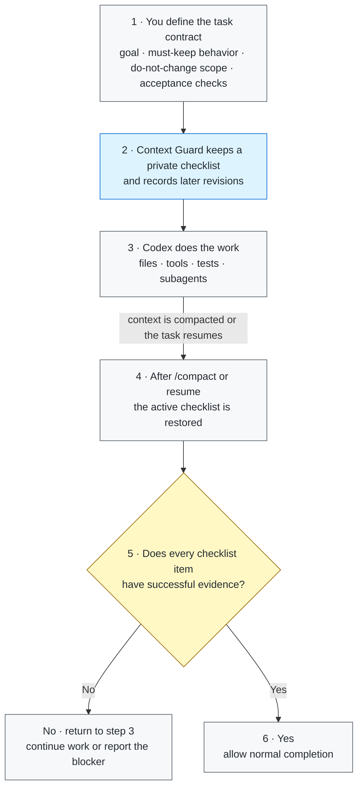

# Context Guard

[](https://github.com/GreenLv/codex-context-guard/actions/workflows/ci.yml)
[](https://github.com/GreenLv/codex-context-guard/actions/workflows/hol-plugin-scanner.yml)
[](https://github.com/GreenLv/codex-context-guard/releases)
[](LICENSE)

[简体中文](README.zh-CN.md)

Context Guard is a local correctness sidecar for long-running Codex tasks. It
keeps authoritative requirements, acceptance criteria, revisions, bounded
native-plan state, delegated-agent provenance, and verification evidence in a
private local ledger so that compaction does not silently erase the task
contract.

It does **not** replace Codex compaction, Plan or Goal mode, memories,
subagents, worktrees, or the transcript. Codex owns those systems; Context
Guard adds a bounded recovery and completion-verification layer beside them.

> Release status: `0.6.1` is the current release. `0.6.3` is an unreleased
> one-way-safety candidate: Stop protocol 1.1.0 makes legacy `continue`
> advisory, preserves pending work on terminal mismatch, and uses quote-aware
> shell intent parsing. `0.6.3` also makes cache upgrades repair indexed live
> drift before archive adoption and removes legacy repository metadata only
> when the trusted product manifest is unchanged. The installed `0.6.2`
> package is immutable and was never tagged or released; its version was
> consumed before those manager lifecycle fixes. The `0.6.0` candidate
> introduced state schema 5, Stop protocol 1.0.0, and diagnostic classifier
> 2.0.0, but a normally trusted fresh Codex Code Mode run exposed a raw-stdout
> staging failure, so `0.6.0` was not tagged or released. Its installed cache is
> immutable and its version number is consumed. `0.6.1` changes only the
> successful private-stage receipt; schema, protocol, classifier, and the exact
> eight-Hook wire remain unchanged. Native macOS acceptance
> covers the scoped source/install/archive gates and normally trusted private
> and public identities without a bypass, including `user_wait`, a completion
> checkpoint, and manual schema-5 `/compact` recovery. The same bounded native
> Windows acceptance is also complete. Release automation is verified
> separately on the exact public commit and tag; CI does not replace either
> native run.

### 30-second sanitized compact/recovery demo

```text
1. Activate Context Guard for a synthetic task with two requirements.
2. Continue normal work, then run /compact.
3. The resumed task receives the same bounded requirement checklist.
4. Completion remains blocked until successful evidence covers both items.
```

The demo contains no real prompts, local paths, task state, or plugin data.

## Why it exists

A long task can survive compaction while still losing the details that matter
most: an original prohibition, a later correction, an acceptance criterion, or
the fact that a local test did not verify the whole task. A normal summary is
useful context, but it is not an immutable task contract.

Context Guard therefore separates four things:

1. what the user required;
2. what later revisions explicitly superseded;
3. what tools actually produced and whether that outcome was successful;
4. what may safely be claimed complete.

## Core behavior

- Journals root and delegated prompts with SHA-256-bound metadata.
- Assigns stable requirement and acceptance IDs and records explicit
  supersessions without silently rewriting history.
- Saves a bounded recovery packet before compaction and restores it on compact
  or resume.
- Mirrors the latest successful native `update_plan` call as a read-only
  recovery index.
- Records bounded, provenance-aware delegated-agent contracts and results, not
  transcripts or hidden reasoning.
- Treats unstructured or ambiguous tool output as unknown and prevents it from
  satisfying completion gates.
- Keeps exactly one private turn-bound staged control: a completion checkpoint,
  or `continue`, `user_wait`, `external_wait`, or `deferred`.
- Accepts a private stage request only after the exact hash marker is paired
  with a successful tool outcome. For raw stdout, the successful CLI emits a
  final standalone `Script completed` receipt. A bare marker remains rejected,
  and structured failure, nonzero status, or hard failure text takes priority.
  Control commands never become requirement-closing evidence.
- Yields safely with requirements still pending when no disposition is staged.
  A verified checkpoint, a narrow whole-task completion claim, and explicit
  user persistence retain fixed Stop priority. The legacy `continue` value is
  accepted for compatibility but is advisory only and cannot force a new turn.
- Uses natural-language action ownership only as a diagnostic signal. It cannot
  turn an ordinary assistant future, user handoff, external wait, or deferred
  phase into a hard continuation by itself.
- Stores at most 32 recent Stop decisions as timestamps, turn IDs, protocol and
  control sources, declared dispositions, diagnostic outcomes, hashes, and
  reason codes. It stores no raw reply text.
- Serializes concurrent session updates with a bounded cross-platform file
  lock, including the Windows access-denied/holder-exit race observed in CI.
- Replaces binary/data-URL payloads with bounded type, length, and hash
  metadata.
- Verifies private-state integrity and reconstructs only from hash-verified
  immutable prompt records; unrecoverable state fails closed.
- Supports redacted handoff exports and explicit, bounded successor packs.

## Architecture



Codex still owns the work, compaction, Plan/Goal state, and subagents. Context
Guard carries only the bounded correctness checklist across the context
boundary and checks it before a completion claim is accepted.

See [Architecture](docs/ARCHITECTURE.md) and
[Privacy](docs/PRIVACY.md) for the full boundary.

## Everyday example: refactor code without breaking callers

Imagine a repository exposes `submit_order(payload)` to several existing
callers. You ask Codex to clean up an increasingly hard-to-maintain checkout
module.

### 1. Initial request

```text
Refactor checkout validation out of checkout.py into validators.py.

Requirements:
- Keep the public submit_order(payload) signature and behavior unchanged.
- Do not add or edit database migrations.
- Add regression tests for invalid coupons and duplicate orders.
- Finish only when the existing and new tests pass.
```

Context Guard turns those requirements into a private checklist. Codex remains
free to inspect files, make a plan, edit code, run tools, or delegate bounded
subtasks normally.

### 2. A later correction

```text
One more constraint: keep normalize_phone() as a compatibility wrapper because
an older integration still imports it directly.
```

The correction is appended to the checklist; it does not silently rewrite the
original request.

### 3. The task becomes long and `/compact` runs

After many file reads, edits, test failures, and fixes, the conversation is
compacted. A normal summary might remember “move validation and make tests
pass” while dropping the compatibility wrapper or migration prohibition.
Context Guard restores the active checklist instead:

```text
Still required after compaction:
- submit_order(payload) remains compatible with existing callers.
- Database migrations remain untouched.
- normalize_phone() remains as a compatibility wrapper.
- Invalid-coupon and duplicate-order regressions exist.
- Existing and new tests must pass before completion.
```

### 4. “The refactor is done” is checked against evidence

Before Codex can finish, each open item still needs captured successful
evidence:

| Checklist item | Example evidence | If evidence is missing |
| --- | --- | --- |
| Public API unchanged | signature/contract inspection and compatibility tests | continue working |
| No migration changes | a successful diff check over the migration directory | continue working |
| Wrapper preserved | implementation inspection plus its regression test | continue working |
| Required behavior covered | invalid-coupon and duplicate-order tests exist | continue working |
| Refactor passes | existing and new test suites exit successfully | allow completion |

The final reply can then say what changed and cite the checks that passed,
without relying on the post-compaction summary to remember every constraint.

This is a representative refactoring case, not a benchmark or a claim of
semantic proof. Context Guard ensures that requirements remain visible and
that completion is evidence-bound; humans and tests still decide whether the
implementation is actually correct.

## Requirements

- Python 3.10 or newer. The Hook runtime has no third-party dependencies.
- Codex CLI `0.146.0` or newer as the tested minimum baseline. This is a tested
  lower bound, not a promise of compatibility with every future Codex version.
- A supported Codex surface that loads plugins and lifecycle Hooks.

## Install from a local clone

Install from the public GitHub repository:

```shell
git clone https://github.com/GreenLv/codex-context-guard.git
cd codex-context-guard
python3 scripts/manage_plugin.py --apply
```

On Windows, use a Python 3.10+ launcher:

```powershell
py -3.10 scripts\manage_plugin.py --apply
```

The helper registers this non-default repository marketplace, installs
`context-guard@codex-context-guard`, verifies source/cache parity, and archives
every version under `CODEX_HOME/plugins/cache-archive/codex-context-guard/context-guard/`
with a trusted SHA-256 index. Read-only runs audit the archive; `--apply` repairs
a missing or changed live cache only from the trusted archive. Archive damage
fails closed, archives are never auto-pruned, and same-version source drift is
still rejected.

Installing a plugin does not automatically trust its Hooks. Start a fresh
Codex CLI task, open `/hooks`, inspect the eight definitions, and trust them
only if they match this repository. Do not use a trust-bypass flag. Start
another fresh task after installation or Hook changes.

Related official documentation: [package a plugin](https://developers.openai.com/plugins/build/plugins),
[install and use plugins](https://learn.chatgpt.com/docs/plugins), and
[advanced Hook configuration](https://learn.chatgpt.com/docs/config-file/config-advanced#hooks).

## Quick check

In a fresh task:

```text
$context-guard
```

Then run:

```text
context-guard status
context-guard diagnose
```

For a recovery smoke test, start a non-trivial task, use `/compact`, and confirm
that the immediate continuation contains a bounded recovery packet with the
same requirements. A successful local unit test is not by itself proof that a
real compact/resume path worked.

Maintainers can run the isolated installed lifecycle smoke against an installed
cache:

```shell
python3 scripts/smoke_installed.py
```

## User controls

- `$context-guard` or `context-guard on` activates full recovery and completion
  gating.
- `context-guard off` disables recovery and completion gating while preserving
  prompt journaling.
- `context-guard status` reports protected-state counts, Stop protocol and
  classifier versions, and the latest decision without exposing raw prompts.
- `context-guard diagnose` reports bounded protocol/control sources, declared
  dispositions, diagnostic outcomes, reason codes, and hashes without raw
  prompts or replies.
- `context-guard export <path>` writes a redacted handoff inside the current
  project. The default is `.codex/context-guard/CONTEXT_HANDOFF.md`.
- `context-guard rollover <directory>` validates an explicitly prepared
  successor input and writes a non-overwriting bounded handoff plus hash
  manifest. It never creates or authorizes another task.

Read [Successor Pack Input](skills/context-guard/references/successor-pack.md)
before using `rollover`.

## Observed token overhead

Context Guard adds prompt and recovery context to protected tasks. In a small,
anonymized sample of five completed, tool-heavy desktop tasks using 0.6.1,
direct Hook/recovery context represented about **1.4%** of total tokens; including
plugin-triggered status checks brought the weighted observation to about
**1.5%**. Individual observations were roughly **0.2%–2.1%**, so **about 1%–2%**
is a useful order-of-magnitude estimate for similar long-running work, not a
guaranteed rate.

The share varies with compaction frequency, ledger size, explicit skill loading,
and tool-call density. Token share is also not the same as cost share because
cached input pricing cannot be attributed precisely from local session logs.

## Private data and retention

Plugin runtime data is written under Codex-managed `PLUGIN_DATA`. The direct
CLI fallback exists for isolated development only. Prompt bodies, task state,
evidence summaries, and recovery files are local runtime data and are not part
of this repository.

Ended sessions are eligible for cleanup after 30 days. Redacted exports are
created only when explicitly requested and remain in the selected project, so
the user controls their retention. Never commit plugin data or generated
`.codex/context-guard/` files without reviewing the export.

Exports omit raw prompt files, transcript content, credentials, authorization
headers, URL query values, and plugin-private paths. See
[Privacy](docs/PRIVACY.md).

## Update and uninstall

To update a local clone:

```shell
git pull --ff-only
python3 scripts/manage_plugin.py --apply
```

Plugin source changes require a version bump. The helper retains trusted
archives and live historical caches so already-running tasks can finish on the
code they loaded. See [Versioning](docs/VERSIONING.md).

To uninstall the public plugin and marketplace:

```shell
codex plugin remove context-guard@codex-context-guard
codex plugin marketplace remove codex-context-guard
```

Uninstalling code does not imply deleting private runtime state. Review the
installed plugin's data location before removing it, and retain it if an active
task may still depend on the old Hook path.

## Validation

```shell
python3 scripts/validate_public_repo.py .
python3 scripts/audit_public_tree.py .
python3 -m unittest discover -s tests -p "test_*.py"
ruff check .
```

Repository validation tools are pinned in `requirements-lock.txt`. The Hook
runtime remains standard-library-only and has no third-party dependencies.

The CI matrix covers Ubuntu, macOS, and Windows with Python 3.10, 3.12, and
3.13. Platform claims remain evidence-bounded; see
[Compatibility](docs/COMPATIBILITY.md).

Native Windows 0.5.1 acceptance remains historical evidence only. The 0.6.1
release has passed the scoped native macOS and Windows source/install/archive
gates and normally trusted, no-bypass private/public runs for `user_wait`,
completion checkpoint, and manual schema-5 `/compact` recovery. The exact
release commit is gated by PR/main CI, HOL, and tag CI; CI is not a
native-runtime substitute.
The unreleased, consumed 0.6.0 candidate failed its real Code Mode fresh gate
and must not be tagged or patched in place. See
[Local release acceptance](docs/LOCAL_ACCEPTANCE.md) for the evidence boundary.

## Explicit non-goals

Context Guard is not:

- a semantic proof that the implementation is correct;
- a general security sandbox or access-control system;
- a transcript backup or cloud synchronization service;
- a second Plan/Goal controller, agent scheduler, mailbox, or shared workspace;
- a replacement for human review, tests, or acceptance.

Requirement-to-evidence semantic relevance is not a 0.6.x capability. It is
deferred to a possible 0.7.0 and requires an approved benchmark with
false-acceptance, false-rejection, and abstention thresholds. Shared
multi-agent workspaces and telemetry remain separate research decisions.

## Contributing and security

See [CONTRIBUTING.md](CONTRIBUTING.md) for development rules. Report sensitive
issues through GitHub Private Vulnerability Reporting as described in
[SECURITY.md](SECURITY.md).

Licensed under the [Apache License 2.0](LICENSE).
