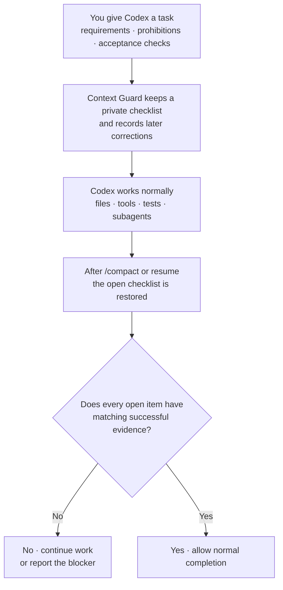

# Context Guard

[](https://github.com/GreenLv/codex-context-guard/actions/workflows/ci.yml)
[](https://github.com/GreenLv/codex-context-guard/actions/workflows/hol-plugin-scanner.yml)
[](https://github.com/GreenLv/codex-context-guard/releases)
[](LICENSE)

[简体中文](README.zh-CN.md) | [Changelog](CHANGELOG.md)

Context Guard keeps important requirements from disappearing during a long Codex task. It restores a private checklist after compaction or resume and requires successful evidence before the task can be reported complete.

It works beside Codex Plan, Goal, memories, subagents, worktrees, and the transcript; it does not replace or control them.

> Release status: `0.8.3` is the latest published release. See the [changelog](CHANGELOG.md), [compatibility matrix](docs/COMPATIBILITY.md), and [local acceptance record](docs/LOCAL_ACCEPTANCE.md).

## Install

Requirements: Python 3.10 or newer, Codex CLI `0.146.0` or newer as the tested minimum, and a Codex surface that loads plugins and lifecycle Hooks.

```shell
git clone https://github.com/GreenLv/codex-context-guard.git
cd codex-context-guard
python3 scripts/manage_plugin.py --apply
```

On Windows:

```powershell
py -3.10 scripts\manage_plugin.py --apply
```

The installer registers the repository marketplace, installs `context-guard@codex-context-guard`, checks source/cache parity, and keeps hash-indexed archives for tasks that still use an older Hook path.

Installing a plugin does not trust its Hooks automatically. Start a fresh Codex task, open `/hooks`, inspect all eight definitions, and trust them only when they match this repository. Start another fresh task after installation or Hook changes.

## Try it

In a fresh task, activate Context Guard:

```text
$context-guard
```

Then inspect the protected state:

```text
context-guard status
context-guard diagnose
```

For a recovery check, use it on a non-trivial synthetic task, run `/compact`, and confirm that the same open requirements return immediately afterward.

## What it protects

- Requirements, acceptance criteria, prohibitions, and later corrections keep stable task-local identities.
- Compaction and resume restore the open checklist instead of relying only on a conversational summary.
- Successful tool evidence must match the required subject and surface before it can close an item.
- Ambiguous output remains `unknown`; damaged or unverifiable private state fails closed.
- Exports are explicit and redacted. Image bytes, credentials, and raw transcript content are not copied into the requirement ledger.

Proof protocol 1.0.0 enforces only obligations that Context Guard can derive deterministically. Other cases remain visible as `legacy_fallback`; this is not arbitrary semantic or pixel-level proof. Stop protocol 1.1.0 keeps completion control turn-bound: an unfinished disposition is advisory only and cannot force a new turn.

## How it works



Codex still owns the work and its native planning state. Context Guard carries only the bounded correctness checklist across context boundaries and checks it before a completion claim.

## Everyday example: write a technical design document without losing decisions

Suppose the task is:

```text
Write docs/design/checkout-v2.md.

- Keep the approved API and data-flow decisions unchanged.
- Do not change the rollout date or add infrastructure commitments.
- Follow the RFC template.
- Give every recommendation a source link or a "to verify" label.
```

After research, edits, diagrams, and `/compact`, Context Guard restores those same items. A passing Markdown check cannot close the whole task: the approved decisions, RFC template, source links, and prohibited commitments each still need matching evidence.

This example explains the contract boundary; it does not claim that Context Guard can decide whether the design itself is sound.

## What you may see in a guarded task

| ID | Meaning |
| --- | --- |
| `R001` | A requirement captured for this task. |
| `A003` | An acceptance item checked independently. |
| `E####` | A successful evidence record that may close a compatible item. |

These are task-local identifiers, not GitHub issues or global task numbers. They may appear in progress text but the private ledger is not printed in the final reply.

## When Context Guard asks Codex to continue

When an open requirement still lacks matching evidence, Context Guard may ask Codex to continue with this standard redacted message:

```text
[Context Guard continuation] The task is not yet safely complete.
```

The message is normal when requested work is still open. It is a warning sign, not proof of a bug: if the task appears complete, ask Codex what remains and run `context-guard status` or `context-guard diagnose` to see which bounded condition triggered it. Earlier versions did sometimes misread quoted completion text as `whole_completion_without_checkpoint` or confuse a user handoff with assistant-owned work; reports of surprising continuation messages led to several classifier fixes. The current protocol yields safely when work is waiting for the user, an external result, or an explicit deferral.

An active task can also keep an old immutable Hook path after an upgrade. That is a separate installation-lifecycle problem; its diagnostic form is:

```text
python3: can't open file '.../context-guard/0.7.3/scripts/context_guard.py'
```

Start a fresh task after upgrades; do not overwrite a consumed versioned cache. See [Versioning](docs/VERSIONING.md) for the lifecycle contract.

## User controls

| Command | Purpose |
| --- | --- |
| `$context-guard` or `context-guard on` | Activate recovery and completion gating. |
| `context-guard off` | Disable gating while preserving prompt journaling. |
| `context-guard status` | Show protected-state counts without raw prompts. |
| `context-guard diagnose` | Show bounded diagnostics without raw prompts or replies. |
| `context-guard export <path>` | Write an explicit redacted handoff in the current project. |
| `context-guard rollover <directory>` | Validate prepared successor input and write a non-overwriting handoff plus hash manifest. |

Read [Successor Pack Input](skills/context-guard/references/successor-pack.md) before using `rollover`. It never creates or authorizes another task.

## Private data and retention

Runtime data is stored under Codex-managed `PLUGIN_DATA`. Prompt bodies, task state, evidence summaries, and recovery files remain local runtime data and are not part of this repository.

Ended sessions are eligible for cleanup after 30 days. Redacted exports are created only when requested and omit raw prompts, transcripts, credentials, authorization headers, URL query values, and plugin-private paths. See [Privacy](docs/PRIVACY.md).

## Observed token overhead

In a small anonymized sample of five completed tool-heavy desktop tasks on 0.6.1, direct Hook/recovery context was about 1.4% of total tokens; including plugin-triggered checks brought the observation to about 1.5%. Treat about 1%–2% as an order-of-magnitude estimate for similar tasks, not a guarantee.

## Update and uninstall

```shell
git pull --ff-only
python3 scripts/manage_plugin.py --apply
```

Plugin source changes require a version bump. Historical caches and trusted archives remain available to tasks that already loaded them.

```shell
codex plugin remove context-guard@codex-context-guard
codex plugin marketplace remove codex-context-guard
```

Removing code does not remove private runtime data. Keep old data or caches while an active task may still depend on them.

## Documentation

- [Architecture](docs/ARCHITECTURE.md)
- [Privacy](docs/PRIVACY.md)
- [Compatibility](docs/COMPATIBILITY.md)
- [Versioning](docs/VERSIONING.md)
- [Local acceptance](docs/LOCAL_ACCEPTANCE.md)
- [Changelog](CHANGELOG.md)

## Validation

```shell
python3 scripts/validate_public_repo.py .
python3 scripts/audit_public_tree.py .
python3 -m unittest discover -s tests -p "test_*.py"
ruff check .
```

The Hook runtime uses only the Python standard library. CI covers Ubuntu, macOS, and Windows on Python 3.10–3.13; CI does not substitute for native Hook trust or installed lifecycle evidence.

## Explicit non-goals

Context Guard is not a semantic proof system, security sandbox, transcript backup, cloud sync service, second Plan/Goal controller, agent scheduler, or replacement for tests and human review.

The `0.8.3` execution-contract model is dormant until an explicit root-user adoption control succeeds. It adds no `PreToolUse` Hook, does not block tools, does not modify Codex Plan state, and does not grant authority.

## Contributing and security

See [CONTRIBUTING.md](CONTRIBUTING.md). Report sensitive issues through GitHub Private Vulnerability Reporting as described in [SECURITY.md](SECURITY.md).

Licensed under the [Apache License 2.0](LICENSE).
