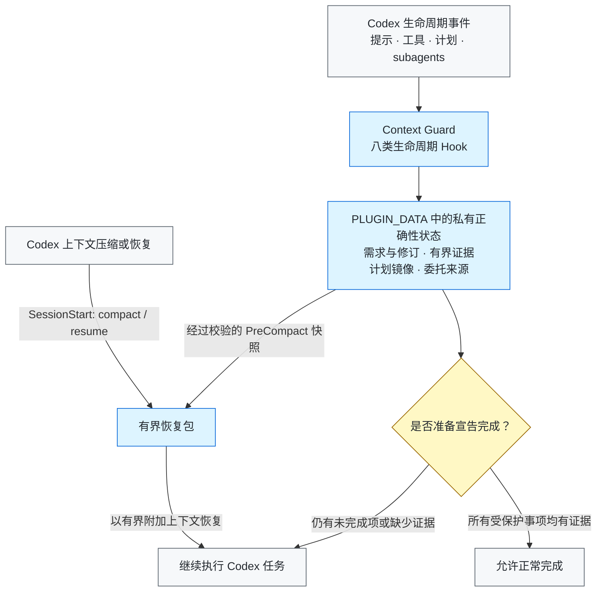

# Context Guard

[English](README.md)

Context Guard 是面向 Codex 长任务的本地正确性旁路（correctness sidecar）。它把
权威需求、验收标准、后续修订、有限的原生计划状态、委托 Agent 来源和验证证据保存
在私有本地账本中，避免上下文压缩后任务契约被静默遗忘。

它**不替代** Codex 的 compaction、Plan/Goal mode、memories、subagents、
worktrees 或 transcript。上述能力仍由 Codex 原生系统负责；Context Guard 只在旁边
补充有界恢复与完成证据门禁。

> 发布状态：`0.4.9` 是首个公开发行版；通用插件目录投稿仍是独立的可选后续工作。

## 为什么需要它？

长任务经过上下文压缩后，可能仍然“记得做过哪些工作”，却丢失真正决定正确性的
细节：最初的禁止事项、后来修正的要求、必须满足的验收标准，或者“某个局部测试
通过并不代表整个任务已经完成”。普通摘要很有用，但它不是不可变的任务契约。

Context Guard 因此把四件事分开记录：

1. 用户实际提出了什么要求；
2. 后续修订明确替代了什么；
3. 工具实际产生了什么结果，这个结果是否成功；
4. 哪些证据足以支持完成声明。

## 核心能力

- 使用 SHA-256 绑定的元数据记录根提示和委托提示。
- 为需求和验收项分配稳定 ID，显式记录 supersession，不静默改写历史。
- 在压缩前保存有界恢复包，并在 compact 或 resume 时恢复任务边界。
- 将最近一次成功的原生 `update_plan` 调用镜像为只读恢复索引。
- 保存有来源的有界委托契约和 Agent 结果，不保存 transcript 或隐藏推理。
- 将无结构或含糊的工具输出记为 unknown，阻止其满足完成门禁。
- 即使回复同时报告了局部工作完成，只要仍明确等待用户验收、授权、确认或决定，
  就继续将整个任务视为未完成状态。
- 使用有界跨平台文件锁串行化同一会话的并发更新，并覆盖公开 CI 发现的 Windows
  access-denied/持有者退出竞态。
- 将二进制和 data URL 替换为类型、长度与哈希元数据。
- 校验私有状态完整性；只允许从通过哈希验证的不可变提示记录重建，无法重建时
  fail closed。
- 支持脱敏 handoff 和显式、受限、不可覆盖的 successor pack。

## 架构



完整职责边界见[架构说明](docs/ARCHITECTURE.md)和
[隐私说明](docs/PRIVACY.md)。

## 实际效果示例

下面是首个公开版本真实手工 `/compact` 验收的脱敏案例，不包含私有 transcript、
会话标识或插件状态。

### 压缩前的任务契约

```text
R1. 始终保留精确标记 ALPHA-049。
R2. 始终保留精确标记 BETA-READONLY。
R3. 不得修改任何文件。
R4. 只有在真实 /compact 后的下一轮同时报告两个精确标记，任务才可完成。
```

用户随后执行 `/compact`。`PreCompact` 触发时，Context Guard 校验私有状态并写入
有界恢复快照；`SessionStart: compact` 触发时，它把仍然有效的需求和完成规则作为
附加上下文恢复。

### 压缩后的第一轮回复

```text
精确标记：ALPHA-049、BETA-READONLY。
未修改任何文件。
```

| 阶段 | 仅依赖摘要时可能出现的风险（示意，并非对照实验） | Context Guard 的实测结果 |
| --- | --- | --- |
| `/compact` 前 | 精确限制与长 transcript 中的其他细节竞争。 | 私有账本为需求分配稳定 ID。 |
| `/compact` 后 | 宽泛摘要可能还记得“执行检查”，却漏掉某个标记或禁止事项。 | 有界恢复包重新注入两个标记和禁止写文件要求。 |
| 准备完成时 | 局部 `PASS` 可能被误认为整体任务已经完成。 | 只有受保护事项都绑定了成功证据，完成门禁才会放行。 |

这个案例证明的是“需求能够被恢复”和“完成决策受证据约束”，并不证明任意证据在
语义上都足以满足需求，也不是对所有摘要方案的受控基准测试。

## 环境要求

- Python 3.10 或更高版本；Hook runtime 没有第三方运行时依赖。
- Codex CLI `0.146.0` 或更高版本是当前已测试的最低基线。这只是经过验证的下限，
  不是对所有未来 Codex 版本的兼容承诺。
- 能够加载插件和生命周期 Hook 的 Codex 使用界面。

## 从本地克隆安装

从公开 GitHub 仓库安装：

```shell
git clone https://github.com/GreenLv/codex-context-guard.git
cd codex-context-guard
python3 scripts/manage_plugin.py --apply
```

Windows 使用 Python 3.10+ launcher：

```powershell
py -3.10 scripts\manage_plugin.py --apply
```

安装器会注册这个非默认 repo marketplace，安装
`context-guard@codex-context-guard`，检查源码与缓存一致性，并在升级时保留旧版本
缓存。如果源码在相同版本号下发生变化，它会拒绝就地刷新，因为仍在运行的任务
可能继续调用旧的绝对 Hook 缓存路径。

安装插件并不等于信任 Hook。安装后应启动一个新的 Codex CLI 任务，打开 `/hooks`，
逐项检查八类 Hook 定义，只在内容与本仓库一致时信任。不要使用 trust bypass。
安装或 Hook 变化后，再启动一个全新任务进行测试。

相关官方文档：[插件打包](https://developers.openai.com/plugins/build/plugins)、
[安装和使用插件](https://learn.chatgpt.com/docs/plugins)以及
[Hook 高级配置](https://learn.chatgpt.com/docs/config-file/config-advanced#hooks)。

## 快速检查

在全新任务中输入：

```text
$context-guard
```

然后运行：

```text
context-guard status
```

如需验证恢复链，应创建一个非简单任务，执行 `/compact`，并检查紧接着的 continuation
是否恢复相同需求。单元测试通过不能代替真实 compact/resume 验证。

维护者可以对已安装缓存运行隔离生命周期 smoke：

```shell
python3 scripts/smoke_installed.py
```

## 用户控制

- `$context-guard` 或 `context-guard on`：启用完整恢复与完成门禁。
- `context-guard off`：关闭恢复和完成门禁，但继续记录提示。
- `context-guard status`：显示保护状态和数量，不暴露原始提示。
- `context-guard export <path>`：在当前项目中生成脱敏 handoff；默认路径为
  `.codex/context-guard/CONTEXT_HANDOFF.md`。
- `context-guard rollover <directory>`：验证用户显式准备的 successor 输入，写入
  不可覆盖的有界 handoff 和哈希清单；它不会创建或授权另一个任务。

使用 `rollover` 前请阅读
[Successor Pack 输入说明](skills/context-guard/references/successor-pack.md)。

## 私有数据与保留期

插件运行时数据写入 Codex 管理的 `PLUGIN_DATA`。直接 CLI fallback 只用于隔离开发。
提示正文、任务状态、证据摘要和恢复文件都是本机运行时数据，不属于本仓库。

已结束会话在 30 天后可以被清理。脱敏导出只在用户明确请求时创建，并保留在用户
选择的项目中，因此由用户决定保留时间。未经检查，不要提交插件数据或生成的
`.codex/context-guard/` 文件。

导出会省略原始提示文件、transcript 正文、凭据、认证头、URL query 和插件私有
路径。详见[隐私说明](docs/PRIVACY.md)。

## 更新与卸载

更新本地克隆：

```shell
git pull --ff-only
python3 scripts/manage_plugin.py --apply
```

插件源码变化必须更新版本号。安装器会保留旧版本缓存，让已经运行的任务继续使用
其最初加载的代码。

卸载公开插件和 marketplace：

```shell
codex plugin remove context-guard@codex-context-guard
codex plugin marketplace remove codex-context-guard
```

卸载代码并不等于删除私有运行时数据。删除前应检查插件数据位置；如果仍有任务依赖
旧 Hook 路径，应继续保留。

## 验证

```shell
python3 scripts/validate_public_repo.py .
python3 scripts/audit_public_tree.py .
python3 -m unittest discover -s tests -p "test_*.py"
ruff check .
```

CI 计划覆盖 Ubuntu、macOS、Windows，以及 Python 3.10、3.12、3.13。平台能力只能
按实际证据描述，详见[兼容性说明](docs/COMPATIBILITY.md)。

## 明确不做

Context Guard 不是：

- 证明实现语义正确的 verifier；
- 通用安全沙箱或访问控制系统；
- transcript 备份或云同步服务；
- 第二套 Plan/Goal 控制器、Agent 调度器、mailbox 或共享工作区；
- 人工审查、测试或验收的替代品。

语义证据匹配、共享多 Agent 工作区和 telemetry 不是已承诺 roadmap。只有出现可复现
失败，或另行批准 benchmark-first 计划时，才会重新评估。

## 贡献与安全

开发要求见 [CONTRIBUTING.md](CONTRIBUTING.md)。敏感问题请按
[SECURITY.md](SECURITY.md)通过 GitHub Private Vulnerability Reporting 报告。

项目采用 [Apache License 2.0](LICENSE)。
