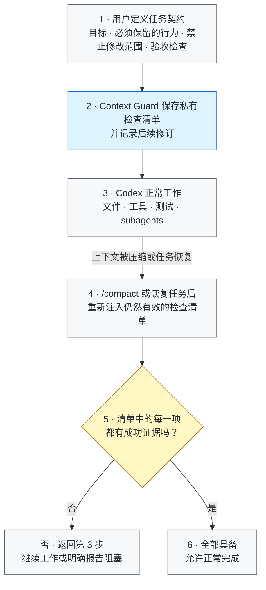

# Context Guard

[](https://github.com/GreenLv/codex-context-guard/actions/workflows/ci.yml)
[](https://github.com/GreenLv/codex-context-guard/actions/workflows/hol-plugin-scanner.yml)
[](https://github.com/GreenLv/codex-context-guard/releases)
[](LICENSE)

[English](README.md)

Context Guard 是面向 Codex 长任务的本地正确性旁路（correctness sidecar）。它把
权威需求、验收标准、后续修订、有限的原生计划状态、委托 Agent 来源和验证证据保存
在私有本地账本中，避免上下文压缩后任务契约被静默遗忘。

它**不替代** Codex 的 compaction、Plan/Goal mode、memories、subagents、
worktrees 或 transcript。上述能力仍由 Codex 原生系统负责；Context Guard 只在旁边
补充有界恢复与完成证据门禁。

> 发布状态：`0.5.1` 保持 state schema 4，并将 Stop classifier 更新为
> 1.0.1，修复混合用户交接的动作归属、派生 open-item 一致性和经验证的
> 同版本归档首次采用。Windows 原生 0.5.1 验收已经完成，覆盖首次采用、归档、
> 已安装生命周期和全新可信 Hook；八 Hook 与私有 checkpoint 接口保持不变。

### 30 秒脱敏 compact/recovery 演示

```text
1. 为一个只有两项要求的合成任务启用 Context Guard。
2. 正常执行工作，然后运行 /compact。
3. 恢复后的任务收到同一份有界要求清单。
4. 两项要求都有成功证据前，任务仍不能宣称完成。
```

该演示不包含任何真实提示、路径、任务状态或插件数据。

## 为什么需要它？

长任务经过上下文压缩后，可能仍然“记得做过哪些工作”，却丢失真正决定正确性的
细节：最初的禁止事项、后来修正的要求、必须满足的验收标准，或者“某个局部测试
通过并不代表整个任务已经完成”。普通摘要很有用，但它不是不可变的任务契约。

Context Guard 因此把四件事分开记录：

1. 用户实际提出了什么要求；
2. 后续修订明确替代了什么；
3. 工具实际产生了什么结果，这个结果是否成功；
4. 哪些证据足以支持完成声明。

## 核心能力

- 使用 SHA-256 绑定的元数据记录根提示和委托提示。
- 为需求和验收项分配稳定 ID，显式记录 supersession，不静默改写历史。
- 在压缩前保存有界恢复包，并在 compact 或 resume 时恢复任务边界。
- 将最近一次成功的原生 `update_plan` 调用镜像为只读恢复索引。
- 保存有来源的有界委托契约和 Agent 结果，不保存 transcript 或隐藏推理。
- 将无结构或含糊的工具输出记为 unknown，阻止其满足完成门禁。
- 即使回复同时报告了局部工作完成，只要仍明确等待用户验收、授权、确认或决定，
  就继续将整个任务视为未完成状态。
- 按动作类别、所有者和本轮授权判断剩余工作。用户接管、外部等待以及被拒绝或
  超出范围的后续阶段可以结束回合；任何仍获授权且由代理执行的事项继续进入门禁。
- 输出稳定的决策结果类和 reason codes；“等待外部审核”不能掩盖同一回复中仍由
  代理执行的发布或仓库修改。
- 最多保存 32 条 Stop 决策的时间、turn ID、classifier 版本、哈希、reason codes
  和动作事实，不保存原始回复正文。
- 使用有界跨平台文件锁串行化同一会话的并发更新，并覆盖公开 CI 发现的 Windows
  access-denied/持有者退出竞态。
- 将二进制和 data URL 替换为类型、长度与哈希元数据。
- 校验私有状态完整性；只允许从通过哈希验证的不可变提示记录重建，无法重建时
  fail closed。
- 支持脱敏 handoff 和显式、受限、不可覆盖的 successor pack。

## 架构



任务执行、上下文压缩、Plan/Goal 状态和 subagents 仍由 Codex 原生系统负责。
Context Guard 只把与正确性有关的有界检查清单带过上下文边界，并在宣告完成前核对它。

完整职责边界见[架构说明](docs/ARCHITECTURE.md)和
[隐私说明](docs/PRIVACY.md)。

## 日常示例：重构代码，但不能破坏现有调用方

假设一个项目已经有多个调用方依赖 `submit_order(payload)`，但结算模块越来越难维护，
于是你让 Codex 整理这部分代码。

### 1. 最初的任务

```text
把 checkout.py 中的订单校验逻辑重构到 validators.py。

要求：
- 保持公开接口 submit_order(payload) 的签名和行为不变。
- 不得新增或修改数据库 migration。
- 为无效优惠券和重复订单补充回归测试。
- 只有现有测试和新增测试都通过，任务才算完成。
```

Context Guard 把这些要求整理成私有检查清单。Codex 仍可正常读取文件、制定计划、
编辑代码、运行工具或把有界子任务交给 subagent。

### 2. 中途又补充了一条限制

```text
再补充一条：保留 normalize_phone() 作为兼容包装函数，因为旧集成仍会直接导入它。
```

这条修订会追加到检查清单中，而不是静默改写最初的任务。

### 3. 任务变长并触发 `/compact`

经过大量文件阅读、代码修改、测试失败和修复后，对话发生上下文压缩。普通摘要也许
还记得“移动校验逻辑并让测试通过”，却可能漏掉兼容包装函数或禁止修改 migration。
Context Guard 会恢复仍然有效的检查清单：

```text
压缩后仍须满足：
- submit_order(payload) 对现有调用方保持兼容。
- 数据库 migration 未被修改。
- normalize_phone() 仍作为兼容包装函数存在。
- 已覆盖无效优惠券和重复订单。
- 现有测试和新增测试全部通过后才能完成。
```

### 4. “重构完成”必须先通过证据核对

在 Codex 宣告完成前，每个未完成事项仍需要已经捕获的成功证据：

| 检查事项 | 示例证据 | 缺少证据时 |
| --- | --- | --- |
| 公开接口未变化 | 检查函数签名，并运行兼容性测试 | 继续工作 |
| migration 未变化 | 对 migration 目录执行成功的差异检查 | 继续工作 |
| 包装函数保留 | 检查实现并运行对应回归测试 | 继续工作 |
| 必要行为有覆盖 | 无效优惠券和重复订单测试确实存在 | 继续工作 |
| 重构整体通过 | 现有与新增测试套件均成功退出 | 允许完成 |

最终回复便可以说明改了什么，并列出真正通过的检查，而不是依赖压缩后的摘要记住所有
限制。

这是一个有代表性的重构案例，不是基准测试或语义正确性证明。Context Guard 保证要求
持续可见，并让完成声明绑定证据；实现本身是否正确，仍然需要测试和人工判断。

## 环境要求

- Python 3.10 或更高版本；Hook runtime 没有第三方运行时依赖。
- Codex CLI `0.146.0` 或更高版本是当前已测试的最低基线。这只是经过验证的下限，
  不是对所有未来 Codex 版本的兼容承诺。
- 能够加载插件和生命周期 Hook 的 Codex 使用界面。

## 从本地克隆安装

从公开 GitHub 仓库安装：

```shell
git clone https://github.com/GreenLv/codex-context-guard.git
cd codex-context-guard
python3 scripts/manage_plugin.py --apply
```

Windows 使用 Python 3.10+ launcher：

```powershell
py -3.10 scripts\manage_plugin.py --apply
```

安装器会注册这个非默认 repo marketplace，安装
`context-guard@codex-context-guard`，检查源码与缓存一致性，并在升级时保留旧版本
缓存。如果源码在相同版本号下发生变化，它会拒绝就地刷新，因为仍在运行的任务
可能继续调用旧的绝对 Hook 缓存路径。

安装插件并不等于信任 Hook。安装后应启动一个新的 Codex CLI 任务，打开 `/hooks`，
逐项检查八类 Hook 定义，只在内容与本仓库一致时信任。不要使用 trust bypass。
安装或 Hook 变化后，再启动一个全新任务进行测试。

相关官方文档：[插件打包](https://developers.openai.com/plugins/build/plugins)、
[安装和使用插件](https://learn.chatgpt.com/docs/plugins)以及
[Hook 高级配置](https://learn.chatgpt.com/docs/config-file/config-advanced#hooks)。

## 快速检查

在全新任务中输入：

```text
$context-guard
```

然后运行：

```text
context-guard status
context-guard diagnose
```

如需验证恢复链，应创建一个非简单任务，执行 `/compact`，并检查紧接着的 continuation
是否恢复相同需求。单元测试通过不能代替真实 compact/resume 验证。

维护者可以对已安装缓存运行隔离生命周期 smoke：

```shell
python3 scripts/smoke_installed.py
```

## 用户控制

- `$context-guard` 或 `context-guard on`：启用完整恢复与完成门禁。
- `context-guard off`：关闭恢复和完成门禁，但继续记录提示。
- `context-guard status`：显示保护状态、classifier 版本和最近决策，不暴露原始提示。
- `context-guard diagnose`：显示有界的决策类别、reason codes、哈希、动作所有者和
  授权状态，不暴露原始提示或回复。
- `context-guard export <path>`：在当前项目中生成脱敏 handoff；默认路径为
  `.codex/context-guard/CONTEXT_HANDOFF.md`。
- `context-guard rollover <directory>`：验证用户显式准备的 successor 输入，写入
  不可覆盖的有界 handoff 和哈希清单；它不会创建或授权另一个任务。

使用 `rollover` 前请阅读
[Successor Pack 输入说明](skills/context-guard/references/successor-pack.md)。

## 私有数据与保留期

插件运行时数据写入 Codex 管理的 `PLUGIN_DATA`。直接 CLI fallback 只用于隔离开发。
提示正文、任务状态、证据摘要和恢复文件都是本机运行时数据，不属于本仓库。

已结束会话在 30 天后可以被清理。脱敏导出只在用户明确请求时创建，并保留在用户
选择的项目中，因此由用户决定保留时间。未经检查，不要提交插件数据或生成的
`.codex/context-guard/` 文件。

导出会省略原始提示文件、transcript 正文、凭据、认证头、URL query 和插件私有
路径。详见[隐私说明](docs/PRIVACY.md)。

## 更新与卸载

更新本地克隆：

```shell
git pull --ff-only
python3 scripts/manage_plugin.py --apply
```

插件源码变化必须更新版本号。安装器通过可信 SHA-256 索引持久归档所有历史版本，
只在 `--apply` 时从可信归档修复缺失或变化的 live cache，且从不自动清理归档。
版本策略见 [Versioning](docs/VERSIONING.md)。

卸载公开插件和 marketplace：

```shell
codex plugin remove context-guard@codex-context-guard
codex plugin marketplace remove codex-context-guard
```

卸载代码并不等于删除私有运行时数据。删除前应检查插件数据位置；如果仍有任务依赖
旧 Hook 路径，应继续保留。

## 验证

```shell
python3 scripts/validate_public_repo.py .
python3 scripts/audit_public_tree.py .
python3 -m unittest discover -s tests -p "test_*.py"
ruff check .
```

CI 矩阵覆盖 Ubuntu、macOS、Windows，以及 Python 3.10、3.12、3.13。平台能力只能
按实际证据描述，详见[兼容性说明](docs/COMPATIBILITY.md)。

当前 Windows 原生补充验证覆盖自动化测试、隔离安装生命周期，以及新 Hook 任务的正常
持久信任流程。通过 `CODEX_CA_CERTIFICATE` 向隔离 CLI 提供 Windows 信任根证书后，
真实手工 `/compact` 已完成后端压缩、运行 `PreCompact`、经 `SessionStart` 注入恢复包，
并在不重复提供标记值的压缩后提示中准确恢复两个标记。完整证据见
[本地发布验收记录](docs/LOCAL_ACCEPTANCE.md)。

## 明确不做

Context Guard 不是：

- 证明实现语义正确的 verifier；
- 通用安全沙箱或访问控制系统；
- transcript 备份或云同步服务；
- 第二套 Plan/Goal 控制器、Agent 调度器、mailbox 或共享工作区；
- 人工审查、测试或验收的替代品。

语义证据匹配、共享多 Agent 工作区和 telemetry 不是已承诺 roadmap。只有出现可复现
失败，或另行批准 benchmark-first 计划时，才会重新评估。

## 贡献与安全

开发要求见 [CONTRIBUTING.md](CONTRIBUTING.md)。敏感问题请按
[SECURITY.md](SECURITY.md)通过 GitHub Private Vulnerability Reporting 报告。

项目采用 [Apache License 2.0](LICENSE)。
