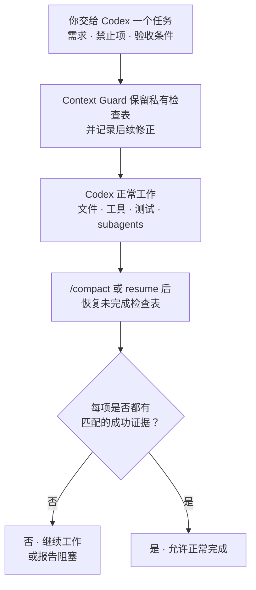

# Context Guard

[](https://github.com/GreenLv/codex-context-guard/actions/workflows/ci.yml)
[](https://github.com/GreenLv/codex-context-guard/actions/workflows/hol-plugin-scanner.yml)
[](https://github.com/GreenLv/codex-context-guard/releases)
[](LICENSE)

[English](README.md) | [介绍文章](https://blog.csdn.net/LvGreat/article/details/163534498) | [更新日志](CHANGELOG.zh-CN.md)

Context Guard 防止长时间 Codex 任务在上下文压缩后漏掉关键要求。它在 compact 或 resume 后恢复私有检查表，并要求每个待办都有成功证据，任务才能报告完成。

它与 Codex 的 Plan、Goal、记忆、子 Agent、工作树和会话记录并行工作，不会替代或控制这些原生能力。

> 当前源码候选：`0.11.0`（未发布）；当前正式版本：`0.10.0`。详见[更新日志](CHANGELOG.zh-CN.md)、[兼容性说明](docs/COMPATIBILITY.md)和[本地验收记录](docs/LOCAL_ACCEPTANCE.md)。

## 安装

需要 Python 3.10 或更高版本、Codex CLI `0.146.0` 或更高版本作为当前已测试下限，以及能够加载插件和生命周期 Hook 的 Codex 界面。

```shell
git clone https://github.com/GreenLv/codex-context-guard.git
cd codex-context-guard
python3 scripts/manage_plugin.py --apply
```

Windows 使用：

```powershell
py -3.10 scripts\manage_plugin.py --apply
```

安装器会把本仓库添加为 marketplace，安装 `context-guard@codex-context-guard`，并检查安装结果。它也会保留升级前任务仍需要的版本化副本。

安装插件不会自动信任 Hook。请启动新的 Codex 任务，打开 `/hooks`，检查并信任全部九个定义，然后再启动一个新任务，让它加载当前版本。

### 版本与兼容性说明

- 未发布的 0.11.0 候选新增同步 `PreToolUse` 发布门禁、精确的一次性 action ticket、基于事实核对的 Stop disposition、去引文的需求替代、append-only 工作单元和紧凑 checkpoint status。精确实现候选 `ea73bed` 已分别通过 macOS 与 Windows 的隔离安装和 fresh-task 验收；CI、正常用户目录安装、打标和发布仍是独立且未执行的阶段。
- 0.10.0 会检查证据是否证明了用户要求的操作。
- Context Guard 会选择符合要求的 Python 解释器，并可从仍然存在的受管缓存恢复。两者都不可用时，它会停止并提示重装，不会猜测执行。

详细版本与平台证据见[兼容性说明](docs/COMPATIBILITY.md)、[更新日志](CHANGELOG.zh-CN.md)和[本地验收记录](docs/LOCAL_ACCEPTANCE.md)。

## 试用

在全新任务中启用 Context Guard：

```text
$context-guard
```

然后检查受保护状态：

```text
context-guard status
context-guard diagnose
```

验证恢复链时，请使用一个非简单的合成任务，执行 `/compact`，并确认未完成要求随即恢复出来。

## 它保护什么

- 需求、验收条件、禁止项和后续修正都有稳定的任务内 ID。
- 上下文压缩和任务恢复会还原未完成检查表，不只依赖会话摘要。
- 工具证据必须对应指定的文件、URL、图片或其他结果，才能关闭对应条目。
- 图片等多模态输入只保存哈希和必要元数据；如果用户要求修改图片，完成证据可以绑定到修改后的图片回读，而不只是“工具运行成功”。
- 含糊输出保持 `unknown`（未知）；损坏或无法验证的私有状态会安全拒绝继续。
- 导出必须显式触发并经过脱敏。图片字节、凭据和会话正文不会复制进需求记录。

只有目标足够具体时，Context Guard 才会自动核对，例如指定文件、URL、修改后的图片或必须全部覆盖的对象清单。如果无法精确验证，它会保留待办，而不是猜测结果。等待用户、外部结果或后续处理不会关闭未完成要求。

## 谁决定什么

- 用户决定任务目标以及允许哪些变更。
- 仓库说明和已选择的 Skill 规定工作流程，但不能增加授权。
- Codex Plan 记录模型当前的执行步骤；Context Guard 可以保留只读引用，但不会修改计划。
- 工具、文件、图片、UI 和公开页面的读回只说明事实。工具成功不能自行授权推送、发布、安装或其他变更。

项目显式采用这些规则后，Context Guard 会记录边界，并在说明或计划发生变化时要求重新确认。它不会拦截工具，也不会授予权限。

## 工作流程



工作过程和原生计划状态仍由 Codex 管理。Context Guard 负责跨上下文保留检查表；项目显式采用仓库说明后，它还会恢复未完成阶段和计划引用，再核对任务是否完成。

## 日常示例：撰写技术方案，但不能漏掉已确认决策

假设任务是：

```text
编写 docs/design/checkout-v2.md。

- 保持已确认的 API 和数据流决策不变。
- 不修改上线日期，不新增基础设施承诺。
- 使用 RFC 模板。
- 每条建议都提供来源链接，或标注“待确认”。
```

经过调研、修改、绘图和 `/compact` 后，Context Guard 恢复相同检查项。Markdown 检查通过不能代表整个任务完成：已确认决策、RFC 模板、来源链接和禁止项仍需各自证据。

这个例子只说明契约边界，不表示 Context Guard 能判断技术方案本身是否合理。

## 在受保护任务中可能看到什么

| ID | 含义 |
| --- | --- |
| `R001` | 当前任务捕获的一条需求。 |
| `A003` | 需要独立检查的一条验收项。 |
| `E####` | 可以关闭兼容条目的成功证据记录。 |

这些都是任务内 ID，不是 GitHub issue 或全局任务编号。它们可能出现在进度说明中，但私有记录不会原样打印在最终回复里。

## 看到“任务尚未安全完成”时

当仍有要求缺少匹配证据时，Context Guard 可能用下面这条标准脱敏提示要求 Codex 继续：

```text
[Context Guard continuation] The task is not yet safely complete.
```

确实还有工作未完成时，这条提示属于正常保护。如果提示与预期不符，可以直接问 Codex 还缺什么，并运行 `context-guard status` 或 `context-guard diagnose`。等待用户、外部结果或明确延期可以结束当前回合，但不会关闭任务。

已有任务可能继续使用启动时加载的 Hook 版本。升级后请启动新任务；如果旧 Hook 路径缺失，请按[版本策略](docs/VERSIONING.md)中的说明恢复。

## 用户控制

| 命令 | 用途 |
| --- | --- |
| `$context-guard` 或 `context-guard on` | 启用恢复和完成门禁。 |
| `context-guard off` | 关闭门禁，但继续记录提示变更。 |
| `context-guard status` | 查看保护状态计数，不暴露原始提示。 |
| `context-guard diagnose` | 查看有界诊断，不暴露原始提示或回复。 |
| `context-guard export <path>` | 在当前项目中显式写出脱敏交接文件。 |
| `context-guard rollover <directory>` | 验证准备好的后续任务输入，写出不可覆盖的交接文件与哈希清单。 |

使用 `rollover` 前请阅读[后续任务输入说明](skills/context-guard/references/successor-pack.md)。它不会创建或授权另一个任务。

## 私有数据与保留期

运行时数据写入 Codex 管理的 `PLUGIN_DATA`。提示正文、任务状态、证据摘要和恢复文件都属于本地运行时数据，不属于本仓库。

已结束会话在 30 天后可以清理。脱敏导出只在显式请求时创建，并省略原始提示、会话正文、凭据、认证头、URL 查询参数和插件私有路径。详见[隐私说明](docs/PRIVACY.md)。

## 更新与卸载

```shell
git pull --ff-only
python3 scripts/manage_plugin.py --apply
```

插件源码变化必须更新版本号。历史缓存和可信归档会继续供已经加载它们的任务使用。

```shell
codex plugin remove context-guard@codex-context-guard
codex plugin marketplace remove codex-context-guard
```

删除代码不会删除私有运行时数据。如果活动任务仍可能依赖旧数据或缓存，请继续保留。

## 文档

- [架构](docs/ARCHITECTURE.md)
- [隐私](docs/PRIVACY.md)
- [兼容性](docs/COMPATIBILITY.md)
- [版本策略](docs/VERSIONING.md)
- [本地验收](docs/LOCAL_ACCEPTANCE.md)
- [更新日志](CHANGELOG.zh-CN.md)

## 验证

```shell
python3 scripts/validate_public_repo.py .
python3 scripts/audit_public_tree.py .
python3 -m unittest discover -s tests -p "test_*.py"
ruff check .
```

Hook 运行时只使用 Python 标准库。CI 覆盖 Ubuntu、macOS、Windows 和 Python 3.10–3.13；CI 不能替代原生 Hook 信任或已安装生命周期证据。

## 明确不做

Context Guard 不是语义证明系统、安全沙箱、会话备份、云同步服务、第二套 Plan/Goal 控制器、Agent 调度器，也不能替代测试和人工审查。

只有发起根任务的用户执行 `context-guard adopt <project-relative-json>` 后，项目说明和计划引用才会被采用。安装 Skill、加载模板或在普通文字中提到计划都不会启用这项行为。Context Guard 不阻止工具、不修改 Codex Plan 状态，也不授予权限。

## 贡献与安全

开发说明见 [CONTRIBUTING.md](CONTRIBUTING.md)。敏感问题请按 [SECURITY.md](SECURITY.md)通过 GitHub Private Vulnerability Reporting 报告。

项目采用 [Apache License 2.0](LICENSE)。
