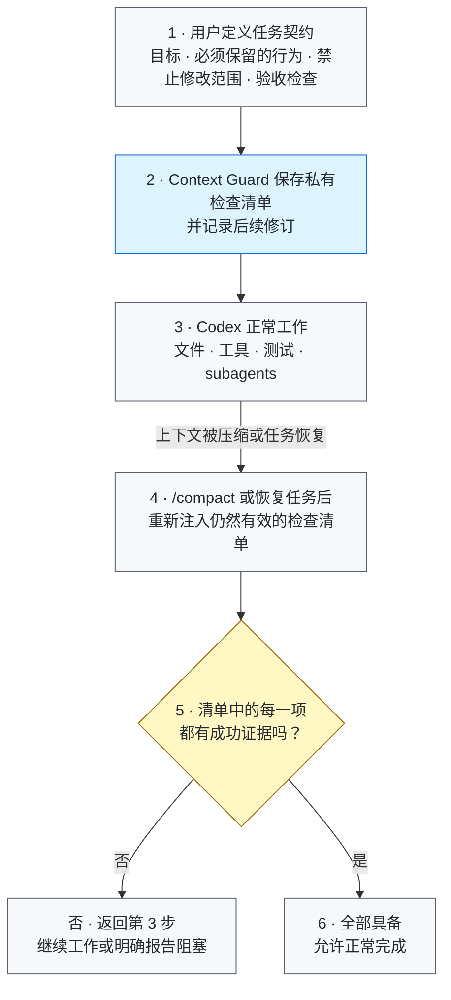

# Context Guard

[](https://github.com/GreenLv/codex-context-guard/actions/workflows/ci.yml)
[](https://github.com/GreenLv/codex-context-guard/actions/workflows/hol-plugin-scanner.yml)
[](https://github.com/GreenLv/codex-context-guard/releases)
[](LICENSE)

[English](README.md)

Context Guard 是面向 Codex 长任务的本地正确性保护层。它让任务中不能丢失的要求
在上下文压缩后仍然清晰可见，并在任务宣称完成前检查是否已有成功证据。

它**不替代** Codex 的 compaction、Plan/Goal mode、memories、subagents、
worktrees 或 transcript。上述能力仍由 Codex 原生系统负责；Context Guard 只在旁边
补充有界恢复与完成证据门禁。

> 发布状态：`0.7.7` 是最近一次已发布版本。协议版本、平台证据和历史版本详见
> [兼容性说明](docs/COMPATIBILITY.md)、
> [本地验收记录](docs/LOCAL_ACCEPTANCE.md)与[更新日志](CHANGELOG.md)。
>
> 当前源码候选：`0.8.3`（未发布）。它加入下文所述的 schema-7 dormant
> 执行契约模型与仅限根用户的契约采用控制；该候选没有 tag 或 GitHub Release。

## 从这里开始

| 如果你想…… | 建议阅读 |
| --- | --- |
| 先理解它解决什么问题 | [为什么需要它](#为什么需要它)和[核心能力](#核心能力) |
| 快速了解工作流程 | [30 秒看懂工作流程](#30-秒看懂工作流程) |
| 安装并亲自试用 | [环境要求](#环境要求)、[安装](#从本地克隆安装)和[快速检查](#快速检查) |
| 查看技术或隐私边界 | [架构说明](docs/ARCHITECTURE.md)、[隐私说明](docs/PRIVACY.md)和[兼容性说明](docs/COMPATIBILITY.md) |

## 为什么需要它？

长任务经过上下文压缩后，可能仍然“记得做过哪些工作”，却丢失真正决定正确性的
细节：最初的禁止事项、后来修正的要求、必须满足的验收标准，或者“某个局部测试
通过并不代表整个任务已经完成”。普通摘要很有用，但它不是不可变的任务契约。

Context Guard 因此把四件事分开记录：

1. 用户实际提出了什么要求；
2. 后续修订明确替代了什么；
3. 工具实际产生了什么结果，这个结果是否成功；
4. 哪些证据足以支持完成声明。

## 核心能力

以下能力按照它们对任务正确性的重要程度降序排列。

| 优先级 | 能力 | 实际含义 |
| --- | --- | --- |
| 1 | **守住任务契约** | 为需求、验收标准、禁止事项和后续修订保留稳定身份。新要求会显式替代旧事项，而不是悄悄改写历史。 |
| 2 | **没有证据就不宣称完成** | 每个未完成事项都必须有成功且匹配的证据。命令即使成功，如果针对了错误文件、错误 UI 表面、错误图片或不完整子集，也不能关闭要求。 |
| 3 | **在 compact 或 resume 后恢复边界** | 压缩前保存有界恢复包；恢复时重新注入有效清单、未完成事项、近期证据和完成规则。 |
| 4 | **让计划、subagent 和视觉工作可追溯** | 将最近一次成功的原生计划镜像为只读索引，记录有来源的有界 subagent 契约与结果，并只用哈希和元数据表示图片，不保存图片字节。 |
| 5 | **失败时保守处理并保护私有状态** | 含糊工具输出保持为 `unknown`，状态损坏或无法验证时 fail closed；私有控制只对当前轮有效，二进制数据最小化保存，导出必须显式触发并经过脱敏。 |

当验证边界能够被确定性构造时，Proof protocol 1.0.0 会强制执行该边界；不支持的
情况会清晰标记为 `legacy_fallback`，而不会包装成语义或像素级证明。协议和生命周期
细节见[架构说明](docs/ARCHITECTURE.md)。

Stop protocol 1.1.0 把完成控制限制在当前轮：未完成 disposition
仅作为提示，不能强制开启新一轮。它只记录本轮为什么结束，不会把 Context Guard
变成任务调度器。

## 30 秒看懂工作流程

```text
1. 为一个只有两项要求的合成任务启用 Context Guard。
2. 正常执行工作，然后运行 /compact。
3. 恢复后的任务收到同一份有界要求清单。
4. 两项要求都有成功证据前，任务仍不能宣称完成。
```

该演示不包含任何真实提示、路径、任务状态或插件数据。

## 架构



任务执行、上下文压缩、Plan/Goal 状态和 subagents 仍由 Codex 原生系统负责。
Context Guard 只把与正确性有关的有界检查清单带过上下文边界，并在宣告完成前核对它。

完整职责边界见[架构说明](docs/ARCHITECTURE.md)和
[隐私说明](docs/PRIVACY.md)。

## 在受保护任务中可能看到什么

Context Guard 会在本地维护一份只属于当前任务的私有 ledger。
模型工作时可能引用这些稳定 ID，但它们不会原样出现在最终给用户的回复中：

| 示例 | 含义 | 实际作用 |
| --- | --- | --- |
| `R001` | 当前任务捕获的第一项 requirement | 跨过 `/compact` 后仍保持 pending，直到记录到匹配的成功证据 |
| `A003` | 当前任务捕获的第三项 acceptance item | 独立核对；附近的一项测试通过，不能静默关闭它 |
| `E####` | 一条成功的 evidence 记录 | 只有 item、subject、surface 和 outcome 都匹配时，才能满足某个 `R`/`A` 项 |

`R001` 和 `A003` 是当前任务私有 ledger 的标识，不是 GitHub issue、错误码或全局任务编号。
另一个任务中的同名 ID 没有相同含义；私有 ledger 也不会被原样展示。

最近的验收工作实际观察到了这一点：一个 pending 的 `R001` 经过真实 `/compact` 后仍然保留，直到有新鲜证据和有效 checkpoint 才能闭合。
另一次仓库 review 中，源码测试虽然通过，但 `R001` 的 enforced readback obligation 仍未解决。
因此 agent 继续引用 requirement，而不是宣称整个任务完成。
这正是它应该产生的效果：守住边界，而不是把局部检查通过误当成整个任务完成。

## 历史上出现过的 Hook 异常

下面是近期相关会话中真实出现过的故障类别。
它们帮助解释反复或意外的 Hook 干预，不是当前版本的正常成功路径，也不代表 Context Guard 能进行任意语义验证。

### 错误命中完成声明

某次回复只是在解释假设句 `may call the task complete after unit tests alone`。
旧分类器却把 `the task complete` 当成当前任务的完整完成声明。
因此 Stop 返回 `whole_completion_without_checkpoint`，模型被迫多输出一轮。

真实 Hook 反馈（已脱敏私有 ID 和命令）：

```text
[Context Guard continuation] The task is not yet safely complete.
Resolve or explicitly report these items.
whole-task completion requires a staged private checkpoint.
```

0.7.4–0.7.6 逐步加入当前任务断言、引文、假设、示例、疑问句、尾随否定、复数完成表述以及后续真实动作的上下文区分。

### 错误识别剩余动作

更早的 0.4.x 会话把用户接手、外部/策略等待或 deferred 阶段误判为 agent 仍有工作。
Stop 要求再来一轮，而正确边界其实是交给用户或等待。
协议优先的设计把“是否真的完成”和“本轮是否继续”分开，使用 typed disposition、安全默认 yield，并限制最多两次 continuation。

### 版本化 Hook 路径失效

运行时升级后，活动任务仍指向旧 cache。
Stop 反复报告无法打开 Hook runtime，原任务无法在当前路径上自愈。

真实 Hook 错误（本地路径已脱敏）：

```text
python3: can't open file '.../context-guard/0.7.3/scripts/context_guard.py': [Errno 2] No such file or directory
```

版本化 cache 不可原地覆盖。
安装器保留并归档历史 cache，升级验证从全新任务开始。

正常的、有界 continuation 只表示本轮还没有建立安全的终止边界——通常是证据不足，或用户明确要求继续。
这并不等于仓库工作本身出错。相同的 Hook 错误反复出现，或干预次数超出有界修正行为时，应把它视为诊断信号。
当前边界和升级规则见[架构说明](docs/ARCHITECTURE.md)、[版本策略](docs/VERSIONING.md)和[兼容性说明](docs/COMPATIBILITY.md)。

## 日常示例：撰写技术方案，但不能漏掉已确认决策

假设你让 Codex 为一个新服务撰写技术方案。任务会经历资料检索、反复修改、图表更新
和评审反馈，同时有几项重要决策已经确认，不能在长任务中被遗漏。

### 1. 最初的任务

```text
为新结算服务撰写 docs/design/checkout-v2.md。

要求：
- 保持已经确认的 API 和数据流图不变。
- 不得修改公开的上线日期，也不得新增基础设施承诺。
- 必须包含问题、设计、风险、上线计划和待确认问题。
- 只有所有清单项都有来自源材料或评审记录的证据，任务才算完成。
```

Context Guard 把这些要求整理成私有检查清单。Codex 仍可正常读取源材料、制定计划、
撰写文档、运行检查或把有界子任务交给 subagent。

### 2. 中途又补充了一条限制

```text
再补充一条：必须使用团队 RFC 模板；每条建议都要附来源链接，或明确标记为“待核实”。
```

这条修订会追加到检查清单中，而不是静默改写最初的任务。

### 3. 任务变长并触发 `/compact`

经过资料检索、文档撰写、图表更新和评审反馈后，对话发生上下文压缩。普通摘要也许
只记得“写完技术方案”，却可能漏掉已确认决策、RFC 模板或来源链接要求。Context Guard
会恢复仍然有效的检查清单：

```text
压缩后仍须满足：
- 已确认的 API 和数据流决策保持不变。
- 没有新增基础设施承诺，也没有修改上线日期。
- 文档遵循 RFC 模板。
- 每条建议都有来源链接，或明确标记为“待核实”。
- 必要章节和待确认问题齐全后才能完成。
```

### 4. “文档完成”必须先通过证据核对

在 Codex 宣告完成前，每个未完成事项仍需要已经捕获的成功证据：

| 检查事项 | 示例证据 | 缺少证据时 |
| --- | --- | --- |
| 已确认决策保留 | 对照源材料和评审决策执行差异检查 | 继续工作 |
| 没有新增承诺 | 扫描上线/基础设施表述并检查差异 | 继续工作 |
| 遵循 RFC 模板 | 对照团队模板检查章节和顺序 | 继续工作 |
| 建议有依据 | 检查来源链接或明确的“待核实”标记 | 继续工作 |
| 文档完整 | 必要章节和链接均已存在 | 允许完成 |

最终回复便可以说明改了什么，并列出真正通过的检查，而不是依赖压缩后的摘要记住所有
限制。

这是一个有代表性的文档撰写案例，不是基准测试或语义正确性证明。Context Guard 保证
要求持续可见，并让完成声明绑定证据；方案中的建议是否合理，仍然需要人工判断。

## 环境要求

- Python 3.10 或更高版本；Hook runtime 没有第三方运行时依赖。
- Codex CLI `0.146.0` 或更高版本是当前已测试的最低基线。这只是经过验证的下限，
  不是对所有未来 Codex 版本的兼容承诺。
- 能够加载插件和生命周期 Hook 的 Codex 使用界面。

## 从本地克隆安装

从公开 GitHub 仓库安装：

```shell
git clone https://github.com/GreenLv/codex-context-guard.git
cd codex-context-guard
python3 scripts/manage_plugin.py --apply
```

Windows 使用 Python 3.10+ launcher：

```powershell
py -3.10 scripts\manage_plugin.py --apply
```

安装器会依次：

1. 把本仓库注册为 marketplace；
2. 安装 `context-guard@codex-context-guard`；
3. 检查源码与已安装 cache 是否一致；
4. 用 SHA-256 索引保留已安装版本，让仍引用旧 Hook 路径的任务可以安全结束。

相同版本号下的源码漂移会被拒绝；可信归档缺失或损坏时会 fail closed。缓存与升级
规则详见[版本策略](docs/VERSIONING.md)。

安装插件并不等于信任 Hook。安装后应启动一个新的 Codex CLI 任务，打开 `/hooks`，
逐项检查八类 Hook 定义，只在内容与本仓库一致时信任。不要使用 trust bypass。
安装或 Hook 变化后，再启动一个全新任务进行测试。

相关官方文档：[插件打包](https://developers.openai.com/plugins/build/plugins)、
[安装和使用插件](https://learn.chatgpt.com/docs/plugins)以及
[Hook 高级配置](https://learn.chatgpt.com/docs/config-file/config-advanced#hooks)。

## 快速检查

在全新任务中输入：

```text
$context-guard
```

然后运行：

```text
context-guard status
context-guard diagnose
```

如需验证恢复链，应创建一个非简单任务，执行 `/compact`，并检查紧接着的 continuation
是否恢复相同需求。单元测试通过不能代替真实 compact/resume 验证。

维护者可以对已安装缓存运行隔离生命周期 smoke：

```shell
python3 scripts/smoke_installed.py
```

## 用户控制

大多数用户只需要前四个控制项：

| 命令 | 用途 |
| --- | --- |
| `$context-guard` 或 `context-guard on` | 启用恢复与完成门禁 |
| `context-guard off` | 关闭门禁，但继续记录提示 |
| `context-guard status` | 查看保护状态与最近决策，不暴露原始提示 |
| `context-guard diagnose` | 查看有界协议与诊断信息，不暴露原始提示或回复 |

以下高级 handoff 控制会显式写入文件：

| 命令 | 用途 |
| --- | --- |
| `context-guard export <path>` | 在当前项目中生成脱敏 handoff；默认路径是 `.codex/context-guard/CONTEXT_HANDOFF.md` |
| `context-guard rollover <directory>` | 验证用户显式准备的 successor 输入，写入不可覆盖的 handoff 与哈希清单；不会创建或授权另一个任务 |

使用 `rollover` 前请阅读
[Successor Pack 输入说明](skills/context-guard/references/successor-pack.md)。

## 实测 token 开销

Context Guard 会向受保护任务注入提示和恢复上下文。在一组经过匿名化的 5 个已完成、
工具调用较多的 0.6.1 桌面任务中，Hook/恢复上下文约占总 token 的 **1.4%**；把插件
触发的状态核对也计入后，加权观测值约为 **1.5%**。单任务观测范围约为
**0.2%–2.1%**，因此对相似的长任务，可以把 **约 1%–2%** 作为量级参考，而不是
固定保证值。

实际占比会随 compact 频率、ledger 大小、是否显式加载 skill 以及工具调用密度变化。
Token 占比也不等于费用占比，因为本地会话日志无法精确归因缓存输入的计费贡献。

## 私有数据与保留期

插件运行时数据写入 Codex 管理的 `PLUGIN_DATA`。直接 CLI fallback 只用于隔离开发。
提示正文、任务状态、证据摘要和恢复文件都是本机运行时数据，不属于本仓库。

已结束会话在 30 天后可以被清理。脱敏导出只在用户明确请求时创建，并保留在用户
选择的项目中，因此由用户决定保留时间。未经检查，不要提交插件数据或生成的
`.codex/context-guard/` 文件。

导出会省略原始提示文件、transcript 正文、凭据、认证头、URL query 和插件私有
路径。详见[隐私说明](docs/PRIVACY.md)。

## 更新与卸载

更新本地克隆：

```shell
git pull --ff-only
python3 scripts/manage_plugin.py --apply
```

插件源码变化必须更新版本号。安装器通过可信 SHA-256 索引持久归档所有历史版本，
只在 `--apply` 时从可信归档修复缺失或变化的 live cache，且从不自动清理归档。
版本策略见 [Versioning](docs/VERSIONING.md)。

卸载公开插件和 marketplace：

```shell
codex plugin remove context-guard@codex-context-guard
codex plugin marketplace remove codex-context-guard
```

卸载代码并不等于删除私有运行时数据。删除前应检查插件数据位置；如果仍有任务依赖
旧 Hook 路径，应继续保留。

## 验证

```shell
python3 scripts/validate_public_repo.py .
python3 scripts/audit_public_tree.py .
python3 -m unittest discover -s tests -p "test_*.py"
ruff check .
```

CI 矩阵覆盖 Ubuntu、macOS、Windows，以及 Python 3.10、3.11、3.12、3.13。平台能力只能
按实际证据描述，详见[兼容性说明](docs/COMPATIBILITY.md)。

未发布的 0.8.3 源码候选加入有界、仅哈希的执行契约 ledger，以及仅限根用户的
`context-guard adopt` 控制。确定性候选可以被采用；自然语言候选仍不具权威性。
原生计划发生语义漂移时，相关记录会标记为 stale，但它不会修改 Codex Plan、
阻止工具、授予权限或新增 `PreToolUse` Hook。源码、安装和原生平台证据分别记录
在兼容性与验收文档中。

0.7.7 正式版本修正了错误对象与 UI 表面分类，并把有效的
`view_image` 图像 data URL 结构化结果识别为成功视觉证据。Schema、Proof/Stop
protocol 与八个 Hook 的 wire contract 不变。限定的 Windows 与 macOS 源码及
隔离安装/生命周期门均已通过；CI 与 HOL 另行验证精确公开提交和 tag，不能替代
原生运行验收。

0.7.6 正式版本将诊断分类器推进到 2.2.0：补上复数/量化完成表述与第一人称转述式
断言的识别，并排除疑问句、尾随否定、引文式与假设式完成表述。限定的 Windows 与
macOS 源码及隔离安装/生命周期门均已通过；CI 与 HOL 另行验证精确公开提交和 tag，
自动化不能替代原生运行。历史版本与候选证据统一保留在
[兼容性说明](docs/COMPATIBILITY.md)和[本地发布验收记录](docs/LOCAL_ACCEPTANCE.md)，
不再挤占这份快速入门文档。

## 明确不做

Context Guard 不是：

- 证明实现语义正确的 verifier；
- 通用安全沙箱或访问控制系统；
- transcript 备份或云同步服务；
- 第二套 Plan/Goal 控制器、Agent 调度器、mailbox 或共享工作区；
- 人工审查、测试或验收的替代品。

Proof protocol 1.0.0 只保证 `enforced` 项中明确显示的确定性义务；它不证明任意
语义正确性，不解释任意像素，也不确认来源是否官方。`legacy_fallback` 保留兼容的
来源/outcome 门禁。共享多 Agent 工作区与 telemetry 仍是独立研究决策。

## 贡献与安全

开发要求见 [CONTRIBUTING.md](CONTRIBUTING.md)。敏感问题请按
[SECURITY.md](SECURITY.md)通过 GitHub Private Vulnerability Reporting 报告。

项目采用 [Apache License 2.0](LICENSE)。
