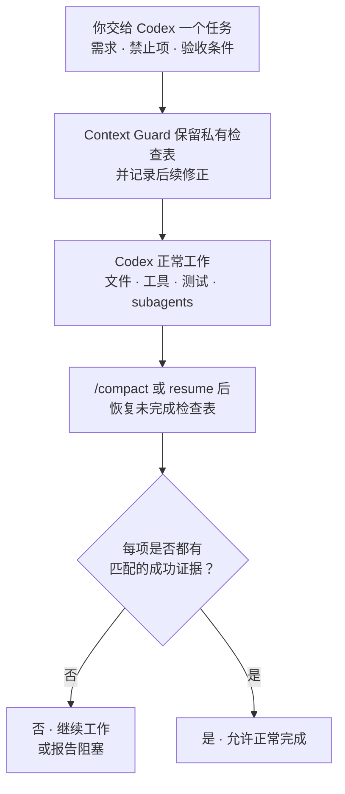

# Context Guard

[](https://github.com/GreenLv/codex-context-guard/actions/workflows/ci.yml)
[](https://github.com/GreenLv/codex-context-guard/actions/workflows/hol-plugin-scanner.yml)
[](https://github.com/GreenLv/codex-context-guard/releases)
[](LICENSE)

[English](README.md) | [介绍文章](https://blog.csdn.net/LvGreat/article/details/163534498) | [更新日志](CHANGELOG.zh-CN.md)

Context Guard 防止长时间 Codex 任务在上下文压缩后漏掉关键要求。它在 compact 或 resume 后恢复私有检查表，并要求每个待办都有成功证据，任务才能报告完成。

它与 Codex 的 Plan、Goal、记忆、子 Agent、工作树和会话记录并行工作，不会替代或控制这些原生能力。

> 发布状态：`0.8.8` 是最近一次已发布版本。`0.8.11` 是未发布源码候选。详见[更新日志](CHANGELOG.zh-CN.md)、[兼容性说明](docs/COMPATIBILITY.md)和[本地验收记录](docs/LOCAL_ACCEPTANCE.md)。

## 安装

需要 Python 3.10 或更高版本、Codex CLI `0.146.0` 或更高版本作为当前已测试下限，以及能够加载插件和生命周期 Hook 的 Codex 界面。

0.8.8 会为 Hook 选择符合要求的 Python 解释器，不再假定 `PATH` 中排在最前面的 `python3` 一定足够新。这对 `/usr/bin/python3` 仍为 3.9 的 macOS 宿主尤其重要。

0.8.11 进一步保证：即使宿主在新任务启动时清理了历史版本缓存，Hook 仍可继续工作。命令优先使用任务信任的插件根目录，在其缺失时回退到受管插件缓存中最新的存活目录，全部缺失时按提示给出可操作的修复指引并失败关闭。

```shell
git clone https://github.com/GreenLv/codex-context-guard.git
cd codex-context-guard
python3 scripts/manage_plugin.py --apply
```

Windows 使用：

```powershell
py -3.10 scripts\manage_plugin.py --apply
```

安装器会注册仓库 marketplace，安装 `context-guard@codex-context-guard`，检查源码与缓存是否一致，并为仍引用旧 Hook 路径的任务保留哈希索引归档。

安装插件不会自动信任 Hook。请启动新的 Codex 任务，打开 `/hooks`，逐项检查八个定义，只在它们与本仓库一致时信任。安装或 Hook 变化后再启动一个全新任务。

## 试用

在全新任务中启用 Context Guard：

```text
$context-guard
```

然后检查受保护状态：

```text
context-guard status
context-guard diagnose
```

验证恢复链时，请使用一个非简单的合成任务，执行 `/compact`，并确认未完成要求随即恢复出来。

## 它保护什么

- 需求、验收条件、禁止项和后续修正都有稳定的任务内 ID。
- 上下文压缩和任务恢复会还原未完成检查表，不只依赖会话摘要。
- 工具证据必须与目标对象和表面匹配，才能关闭对应条目。
- 图片等多模态输入只保存哈希和必要元数据；如果用户要求修改图片，完成证据可以绑定到修改后的图片回读，而不只是“工具运行成功”。
- 含糊输出保持 `unknown`（未知）；损坏或无法验证的私有状态会安全拒绝继续。
- 导出必须显式触发并经过脱敏。图片字节、凭据和会话正文不会复制进需求记录。

Proof protocol 1.0.0 只检查能从用户要求明确得出的事项，例如结果是否对应指定文件或 URL、修改图片后是否检查过结果、是否覆盖用户明确列出的全部对象。无法形成这种明确检查条件的内容会沿用较早的完成检查方式（内部状态名为 `legacy_fallback`），不会假装理解任意语义或像素。Stop protocol 1.1.0 把完成控制限制在当前轮次；未完成处置只作为提示，不能强制开启新一轮。

## 0.8.3 如何区分不同来源

0.8.3 不再把用户要求、仓库说明、Skill、Codex Plan 和工具结果当成可以互相覆盖的同一类文字。采用项目执行契约后，它按下面的顺序记录这些来源各自能决定什么：

| 来源 | 在任务中决定什么 |
| --- | --- |
| 系统、沙箱、平台权限和 Hook 信任 | 这些是硬边界，其他来源不能覆盖。 |
| 发起任务的用户 | 决定目标、允许或禁止哪些写入；Skill 和 Codex Plan 不能扩大这份授权。 |
| 仓库 `AGENTS.md` 和已选择的 Skill | 规定采用哪套工作流和安全检查，但不能自行授权推送、发布或安装。 |
| Codex Plan | 记录模型当前准备怎样执行，可以调整；Context Guard 只保存只读镜像和可选绑定，不会修改计划。 |
| 工具、文件、图片、UI 和公开读回 | 说明当前事实，例如文件是否改变、图片是否检查、页面是否真的公开；成功结果不能凭空产生用户授权。 |

例如，用户要求按某个发布 Skill 更新一篇带头图的文章。Context Guard 可以记录采用的是哪个 Skill、当前执行阶段和可选的 Codex Plan 绑定；图片保护会把头图及修改后的回读绑定到具体对象。如果 Skill 或 Plan 后来变化，旧绑定会标为需要重新确认。仅仅安装了 Skill、模型把“发布”写进 Plan，或工具返回成功，都不能代替用户授权。

0.8.3 只记录和恢复这些关系，并在完成检查时报告变化；它没有加入 `PreToolUse` Hook，不会在工具调用前拦截操作。

## 工作流程



工作过程和原生计划状态仍由 Codex 管理。Context Guard 携带有界的正确性检查表；显式采用 0.8.3 项目契约后，还会恢复已采用的指令来源、未完成阶段和计划变化状态，并在完成声明前核对证据。

## 日常示例：撰写技术方案，但不能漏掉已确认决策

假设任务是：

```text
编写 docs/design/checkout-v2.md。

- 保持已确认的 API 和数据流决策不变。
- 不修改上线日期，不新增基础设施承诺。
- 使用 RFC 模板。
- 每条建议都提供来源链接，或标注“待确认”。
```

经过调研、修改、绘图和 `/compact` 后，Context Guard 恢复相同检查项。Markdown 检查通过不能代表整个任务完成：已确认决策、RFC 模板、来源链接和禁止项仍需各自证据。

这个例子只说明契约边界，不表示 Context Guard 能判断技术方案本身是否合理。

## 在受保护任务中可能看到什么

| ID | 含义 |
| --- | --- |
| `R001` | 当前任务捕获的一条需求。 |
| `A003` | 需要独立检查的一条验收项。 |
| `E####` | 可以关闭兼容条目的成功证据记录。 |

这些都是任务内 ID，不是 GitHub issue 或全局任务编号。它们可能出现在进度说明中，但私有记录不会原样打印在最终回复里。

## 看到“任务尚未安全完成”时

当仍有要求缺少匹配证据时，Context Guard 可能用下面这条标准脱敏提示要求 Codex 继续：

```text
[Context Guard continuation] The task is not yet safely complete.
```

如果确实还有工作没有完成，这条提示属于正常保护。它只是一个需要检查的信号，并不能单独证明存在 bug；如果你认为任务已经完成，可以直接问 Codex 还缺什么，并运行 `context-guard status` 或 `context-guard diagnose` 查看是哪项有界条件触发了提示。历史版本确实出现过把引文中的完成表述误判为 `whole_completion_without_checkpoint`、把用户交接误当成助手后续工作的情况，多次分类器修复也来自用户报告的异常 continuation 提示。当前协议会在等待用户、外部结果或明确延期时安全让出控制。

升级后，活动任务也可能继续引用不可变的旧 Hook 路径。这属于另一类安装生命周期问题，诊断形式如下：

```text
python3: can't open file '.../context-guard/0.7.3/scripts/context_guard.py'
```

升级后请启动新任务，不要覆盖已经使用的版本化缓存。生命周期规则见[版本策略](docs/VERSIONING.md)。

## 用户控制

| 命令 | 用途 |
| --- | --- |
| `$context-guard` 或 `context-guard on` | 启用恢复和完成门禁。 |
| `context-guard off` | 关闭门禁，但继续记录提示变更。 |
| `context-guard status` | 查看保护状态计数，不暴露原始提示。 |
| `context-guard diagnose` | 查看有界诊断，不暴露原始提示或回复。 |
| `context-guard export <path>` | 在当前项目中显式写出脱敏交接文件。 |
| `context-guard rollover <directory>` | 验证准备好的后续任务输入，写出不可覆盖的交接文件与哈希清单。 |

使用 `rollover` 前请阅读[后续任务输入说明](skills/context-guard/references/successor-pack.md)。它不会创建或授权另一个任务。

## 私有数据与保留期

运行时数据写入 Codex 管理的 `PLUGIN_DATA`。提示正文、任务状态、证据摘要和恢复文件都属于本地运行时数据，不属于本仓库。

已结束会话在 30 天后可以清理。脱敏导出只在显式请求时创建，并省略原始提示、会话正文、凭据、认证头、URL 查询参数和插件私有路径。详见[隐私说明](docs/PRIVACY.md)。

## 实测 token 开销

在一组经过匿名化的 5 个已完成、工具调用较多的 0.6.1 桌面任务中，Hook 和恢复上下文约占总 token 的 1.4%；计入插件触发的检查后，观测值约为 1.5%。对相似任务，可把约 1%–2% 作为量级参考，而不是固定保证。

## 更新与卸载

```shell
git pull --ff-only
python3 scripts/manage_plugin.py --apply
```

插件源码变化必须更新版本号。历史缓存和可信归档会继续供已经加载它们的任务使用。

```shell
codex plugin remove context-guard@codex-context-guard
codex plugin marketplace remove codex-context-guard
```

删除代码不会删除私有运行时数据。如果活动任务仍可能依赖旧数据或缓存，请继续保留。

## 文档

- [架构](docs/ARCHITECTURE.md)
- [隐私](docs/PRIVACY.md)
- [兼容性](docs/COMPATIBILITY.md)
- [版本策略](docs/VERSIONING.md)
- [本地验收](docs/LOCAL_ACCEPTANCE.md)
- [更新日志](CHANGELOG.zh-CN.md)

## 验证

```shell
python3 scripts/validate_public_repo.py .
python3 scripts/audit_public_tree.py .
python3 -m unittest discover -s tests -p "test_*.py"
ruff check .
```

Hook 运行时只使用 Python 标准库。CI 覆盖 Ubuntu、macOS、Windows 和 Python 3.10–3.13；CI 不能替代原生 Hook 信任或已安装生命周期证据。

## 明确不做

Context Guard 不是语义证明系统、安全沙箱、会话备份、云同步服务、第二套 Plan/Goal 控制器、Agent 调度器，也不能替代测试和人工审查。

只有发起根任务的用户成功执行 `context-guard adopt <project-relative-json>` 后，0.8.3 才会采用项目指令和计划绑定。安装 Skill、加载模板或在普通文字中提到一份计划都不会启用它；本版本也不新增 `PreToolUse` Hook、不阻止工具、不修改 Codex Plan 状态或授予权限。

## 贡献与安全

开发说明见 [CONTRIBUTING.md](CONTRIBUTING.md)。敏感问题请按 [SECURITY.md](SECURITY.md)通过 GitHub Private Vulnerability Reporting 报告。

项目采用 [Apache License 2.0](LICENSE)。
