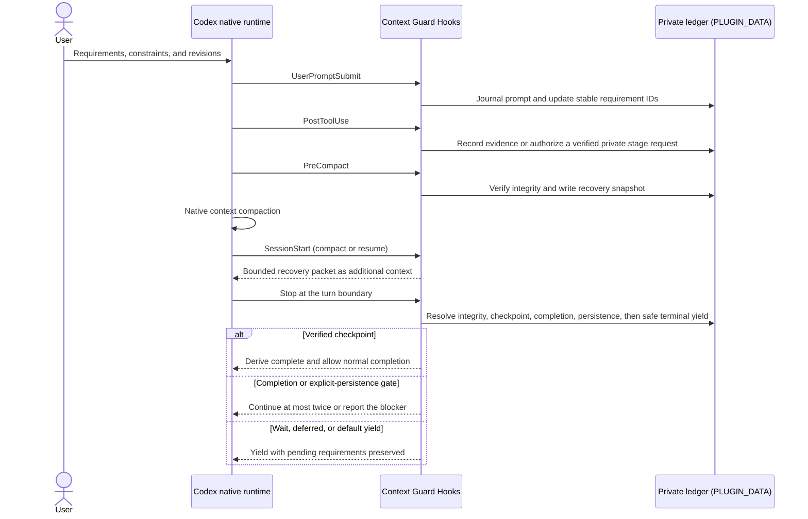

# Architecture

Context Guard is a correctness sidecar for Codex. It observes lifecycle events,
maintains private local task state, compiles a bounded recovery packet, and
gates completion claims against successful, contract-compatible evidence. It does not replace or
control Codex-native orchestration.

## Responsibility boundary

| Concern | Codex owns | Context Guard owns | Context Guard does not do |
| --- | --- | --- | --- |
| Conversation | transcript and compaction | pre-compact correctness snapshot and bounded recovery | copy the full transcript or rewrite the compact prompt |
| Planning | Plan mode and `update_plan` lifecycle | latest successful plan mirror as a read-only index | maintain a second editable plan |
| Goals | Goal lifecycle and UI | completion evidence for guarded task requirements | create, pause, or modify Goals |
| Memory | cross-task recall | task-local authoritative ledger | treat memory as requirement authority |
| Agents | spawning, messaging, waiting, permissions | delegated provenance and bounded result envelope | implement a scheduler, mailbox, or task lock |
| Worktrees | isolated file changes and Git state | bounded artifact/command evidence | synchronize or merge worktrees |
| Hooks | lifecycle event execution and trust | local state and completion policy | claim Hooks are a complete security boundary |

## End-to-end lifecycle

The arrows describe lifecycle observation and bounded context injection. Codex,
not Context Guard, performs compaction, controls the task lifecycle, and runs
tools or subagents. The private ledger never becomes a second transcript or
editable plan.

## Four-layer model

### L1: immutable task contract

Each prompt is stored in a private, immutable record with a content hash.
Metadata in the session state points to those records. Root human prompts can
create requirements, acceptance items, revisions, and control actions.
Delegated prompts are journaled with delegated authority and cannot create,
cancel, or supersede root requirements.

Supersession is append-only. A later instruction records which earlier item it
replaces; it does not rewrite the earlier record. Negated or ambiguous
supersession language fails closed and leaves the existing requirement active.

### L2: bounded work state and evidence

The latest successful native `update_plan` call is mirrored into
`work_state.plan_snapshot`. Failed plan updates do not replace the last usable
snapshot. The mirror is recovery context only and never controls Codex Plan
mode.

Post-tool evidence records bounded input/output summaries, actor provenance,
outcome, outcome basis, detected subjects, asset IDs, and deterministic surface
capabilities. Structured success/failure is preferred.
Unstructured text and weak success markers are unknown. An exact standalone
completion marker can be successful only when the verification command itself
fails on unmet checks.

Binary and data-URL values are replaced with type, length, and SHA-256 metadata.
Generic typed text remains text; binary omission is based on field and container
semantics rather than a broad base64-looking heuristic.

Schema 6 also maintains a hash-only multimodal asset ledger. Hook payloads and
the bounded transcript tail contribute local-image or data-URL references. The
runtime reads bounded bytes only to calculate SHA-256, byte count, media type,
and dimensions; it stores no image bytes or full local locator. A later tool
event can bind evidence to the same asset hash or to a distinct result-readback
asset.

Late attachment discovery is incremental rather than a per-tool transcript
rescan. A readable transcript is inspected at most once for each pending human
prompt during `PostToolUse`; `PreCompact` and compact/resume `SessionStart`
remain forced recovery opportunities. Only prompt IDs and bounded scan state
are persisted.

### L3: delegated-agent provenance

`SubagentStart` records a bounded delegated contract and injects the root
authority boundary. `SubagentStop` stores a bounded result summary and checks for
the result envelope fields `Outcome`, `Evidence`, `Validation`, `Limitations`,
and `Next`.

The plugin does not read or copy the delegated agent transcript or hidden
reasoning. A delegation wrapper is accepted as delegated only when runtime
metadata or a currently running agent corroborates it.

### L4: recovery and completion verification

`PreCompact` validates state integrity, saves an atomic recovery snapshot, and
fails closed when the correctness state cannot be trusted. `SessionStart` on
compact/resume restores a bounded packet in this priority order:

1. active requirements and acceptance items;
2. explicit supersessions;
3. latest native-plan mirror;
4. active and recent bounded agent state;
5. recent successful/failed evidence;
6. bounded asset metadata and unresolved proof obligations; and
7. completion rules.

The packet uses a reserved suffix budget: lower-priority sections may be
clipped, but the completion rule cannot be displaced by contract or asset
metadata.

The completion gate is bound to the current turn. Only successful evidence
already captured by the Hook may satisfy a requirement or acceptance item.
Private staging remains in plugin data and is never appended to the visible
assistant response.

Proof protocol 1.0.0 derives only deterministic contracts from immutable prompt
signals. Its obligation types cover input-asset inspection, distinct visual
result readback, named path/URL subject readback, and complete-scope coverage.
Complete-scope wording first becomes a candidate; enforcement requires a
prompt-derived expected cardinality or an exact multi-object set and digest.
Qualitative uses such as “完整介绍” or “summarize all changes” abstain to
`legacy_fallback` instead of fabricating an enumerable scope.
An `enforced` contract cannot be weakened after creation. When an attachment or
contract boundary cannot be established, the item is explicitly
`legacy_fallback` and uses the compatible 0.6.3 evidence gate.

`register-proof` authenticates the current session, turn, and private token,
then stores an immutable item/obligation/evidence binding. It rejects failed or
stale evidence, incompatible tool capabilities, wrong subjects/surfaces,
same-image result readbacks, unresolved visual facts, and observed scope sets
that omit any normalized expected identifier. Scope counts and digests are
computed by the runtime rather than accepted as caller claims, and the proof's
expected set must match the prompt-derived cardinality/digest.

Schema 6 retains the schema-5 completion attempt and gives each active attempt one `staged_control` slot. It is
either a verified checkpoint or one typed non-completion disposition:
`continue`, `user_wait`, `external_wait`, or `deferred`. `complete` is not a
disposition; it can be derived only when Stop validates and consumes a
checkpoint covering every non-superseded requirement and acceptance item.
Staging the same control is idempotent, a different control conflicts, and an
intentional change requires `--replace`.

Stop protocol 1.1.0 treats terminal controls as a one-way safety lattice.
`user_wait`, `external_wait`, and `deferred` describe safe handoff boundaries.
The legacy `continue` value remains accepted for protocol compatibility but is
advisory only: assistant work continues through tool calls before a terminal
reply, not by forcing a retry after that reply already exists.

The private `stage-checkpoint` and `stage-disposition` CLI commands are
prechecks, not state-writing authorities. `PostToolUse` is the authoritative
staging path: it verifies the exact command, expected data directory, session,
turn, token hash, and output marker before storing the single control. A
structured tool response must report success. When Code Mode provides only raw
stdout, the successful precheck emits the expected marker followed by a final
standalone `Script completed` receipt. The marker alone is not success;
structured failure, an explicit nonzero exit status, or hard failure text takes
priority over the receipt. A request observed only in assistant text, tool
input, or an unsuccessful/unmatched tool result cannot stage anything, and no
control command is recorded as requirement-closing evidence.

Stop protocol 1.1.0 applies this fixed priority:

1. private-state or prompt-boundary integrity failure, leaked private
   checkpoint/disposition metadata, and malformed staged control fail closed;
2. a hash-verified staged checkpoint is validated first; a valid checkpoint is
   consumed as `complete`, while an invalid checkpoint blocks;
3. a high-confidence whole-task completion claim without a valid checkpoint
   blocks even if a wait or deferred disposition was staged;
4. explicit user persistence blocks a terminal yield unless the next priority
   establishes a genuine unavailable boundary;
5. `user_wait` and `external_wait` yield with requirements still pending;
   `deferred` also yields when persistence is absent, or when the hash-verified
   prompt denies or excludes the specific action identified as deferred; and
6. legacy `continue`, no staged control, or a terminal-control mismatch yields
   safely and leaves every unresolved requirement pending.

Completion and explicit-persistence corrections are capped at two turns.
Classifier 2.2.1 records the
observed natural-language outcome, action facts, and anomalies for diagnosis;
inferred action ownership no longer drives ordinary continuation. Only the
narrow high-confidence whole-task-completion and explicit-persistence checks
participate in the fixed priority above. Classification reads the full
hash-verified prompt record; an ambiguous prompt boundary fails closed. A
completion match is ignored when it is framed as a quotation, hypothetical, or
example, question, or trailing negation, while an explicit assistant assertion
remains actionable. Plural and quantified completion claims such as “all tasks
are complete” are recognized. Negation is bounded to the latest explicit future
segment so a later authorized action is not hidden by an earlier denial.

## Hook lifecycle

| Event | Purpose | Visible context |
| --- | --- | --- |
| `UserPromptSubmit` | journal prompt, classify authority, capture prompt assets, and update requirements/contracts/revisions | activation/status and bounded completion instructions |
| `PostToolUse` | record bounded evidence/assets/capabilities, observe successful `update_plan`, and authoritatively stage a verified private control request | none |
| `PreCompact` | validate state and write recovery snapshot | continue/fail-closed result |
| `SessionStart` | restore bounded context on compact/resume | recovery packet |
| `SubagentStart` | record delegated lifecycle and inject contract | bounded delegated contract |
| `SubagentStop` | record bounded result envelope | warnings only when needed |
| `Stop` | apply integrity/checkpoint/completion/persistence and one-way-safe terminal-yield priority | correction only for verified hard gates |
| `SessionEnd` | mark session ended, write final recovery, run retention cleanup | none |

## Private state

Schema 6 contains:

- session identity and lifecycle timestamps;
- prompt metadata and immutable prompt records;
- requirements, acceptance items, and supersessions;
- evidence with monotonic IDs and bounded retention;
- a hash-only multimodal asset ledger with source type, redacted reference,
  SHA-256, byte count, media type, dimensions, and availability;
- immutable per-item verification contracts plus Proof protocol bindings,
  visual facts, distinct result readbacks, and normalized scope digests;
- `work_state.plan_snapshot`;
- bounded agent records;
- compaction history;
- one turn-bound completion attempt with protocol version, token hash, staging
  timestamp, and a single checkpoint-or-disposition `staged_control`;
- a checkpoint-derived completion record;
- at most 32 hash-only Stop decision records with protocol/classifier versions,
  decision source, disposition and outcome enums, bounded reason/action enums,
  prompt/reply SHA-256, and no raw reply text;
- integrity status and a canonical content hash.

Writes are atomic. Session operations use a cross-platform lock. State is
validated before use; corrupted state is preserved for diagnosis and rebuilt
only from hash-verified prompt records. Reconstructed requirements return to
pending because prior evidence cannot be silently re-trusted. Schema 1, 2, 3,
and 4 migrate through schema 5 to schema 6 while preserving the durable ledger.
Existing schema-5 items are marked `legacy_fallback`; migration never invents
retroactive proof obligations. Migration
deliberately discards any in-flight completion attempt, token, or staged control
so a stale turn cannot authorize the new protocol.

## Historical Hook cache lifecycle

The installer archives immutable version trees under
`CODEX_HOME/plugins/cache-archive/codex-context-guard/context-guard/<version>`
and stores their SHA-256 manifests in an atomic trusted index. It archives live
versions before invoking Codex, restores deleted historical live caches after
installation, and archives the newly installed version after parity succeeds.
Read-only runs audit only; `--apply` repairs a live cache only from a valid
archive. Missing or corrupt archive evidence fails closed, and no archive is
auto-pruned.

## Exports and successor packs

`export` produces a redacted project-bounded handoff. `rollover` additionally
requires a user-prepared input, validates file paths and hashes, enforces byte
and file limits, and writes to a new non-overwriting directory. Neither action
creates, activates, retires, or grants authority to a task.

## Maintenance boundary

The 0.6.x line is limited to the schema-5 private turn-control protocol,
diagnostics, compatible cache lifecycle, correctness/security, tests, and
documentation. It does not add a Hook event, matcher, or Codex Hook payload
field; the existing eight-event `hooks.json` wire contract remains compatible.
The unreleased 0.6.0 candidate established this boundary but failed a real Code
Mode raw-stdout fresh gate because its marker-only response was correctly
classified as unknown. Version 0.6.1 changes only the successful private-stage
receipt; state schema 5, Stop protocol 1.0.0, classifier 2.0.0, dispositions,
Stop priority, and all eight Hooks remain unchanged. The installed 0.6.0 cache
is immutable and must not be patched in place or tagged.

The 0.7.x line adds schema 6 and deterministic Proof protocol 1.x while keeping
Stop protocol 1.1.0 and the eight-event Hook wire. Versions 0.7.4, 0.7.5, and
0.7.6 refine completion assertions and future-action binding; 0.7.7 advances
classifier metadata to 2.2.1 while correcting subject, UI-surface, and
structured visual-result classification. None changes the schema or Hook
surface. It
guarantees only displayed `enforced` obligations and does not claim arbitrary
pixel understanding or semantic completeness for `legacy_fallback` items.
