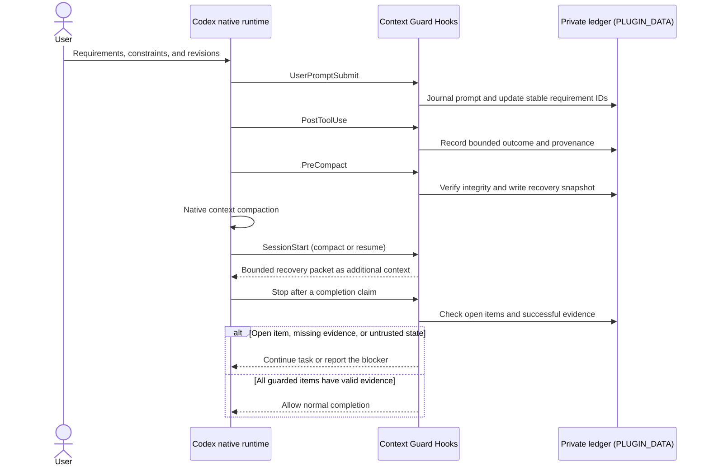

# Architecture

Context Guard is a correctness sidecar for Codex. It observes lifecycle events,
maintains private local task state, compiles a bounded recovery packet, and
gates completion claims against successful evidence. It does not replace or
control Codex-native orchestration.

## Responsibility boundary

| Concern | Codex owns | Context Guard owns | Context Guard does not do |
| --- | --- | --- | --- |
| Conversation | transcript and compaction | pre-compact correctness snapshot and bounded recovery | copy the full transcript or rewrite the compact prompt |
| Planning | Plan mode and `update_plan` lifecycle | latest successful plan mirror as a read-only index | maintain a second editable plan |
| Goals | Goal lifecycle and UI | completion evidence for guarded task requirements | create, pause, or modify Goals |
| Memory | cross-task recall | task-local authoritative ledger | treat memory as requirement authority |
| Agents | spawning, messaging, waiting, permissions | delegated provenance and bounded result envelope | implement a scheduler, mailbox, or task lock |
| Worktrees | isolated file changes and Git state | bounded artifact/command evidence | synchronize or merge worktrees |
| Hooks | lifecycle event execution and trust | local state and completion policy | claim Hooks are a complete security boundary |

## End-to-end lifecycle

The arrows describe lifecycle observation and bounded context injection. Codex,
not Context Guard, performs compaction, controls the task lifecycle, and runs
tools or subagents. The private ledger never becomes a second transcript or
editable plan.

## Four-layer model

### L1: immutable task contract

Each prompt is stored in a private, immutable record with a content hash.
Metadata in the session state points to those records. Root human prompts can
create requirements, acceptance items, revisions, and control actions.
Delegated prompts are journaled with delegated authority and cannot create,
cancel, or supersede root requirements.

Supersession is append-only. A later instruction records which earlier item it
replaces; it does not rewrite the earlier record. Negated or ambiguous
supersession language fails closed and leaves the existing requirement active.

### L2: bounded work state and evidence

The latest successful native `update_plan` call is mirrored into
`work_state.plan_snapshot`. Failed plan updates do not replace the last usable
snapshot. The mirror is recovery context only and never controls Codex Plan
mode.

Post-tool evidence records bounded input/output summaries, actor provenance,
outcome, and outcome basis. Structured success/failure is preferred.
Unstructured text and weak success markers are unknown. An exact standalone
completion marker can be successful only when the verification command itself
fails on unmet checks.

Binary and data-URL values are replaced with type, length, and SHA-256 metadata.
Generic typed text remains text; binary omission is based on field and container
semantics rather than a broad base64-looking heuristic.

### L3: delegated-agent provenance

`SubagentStart` records a bounded delegated contract and injects the root
authority boundary. `SubagentStop` stores a bounded result summary and checks for
the result envelope fields `Outcome`, `Evidence`, `Validation`, `Limitations`,
and `Next`.

The plugin does not read or copy the delegated agent transcript or hidden
reasoning. A delegation wrapper is accepted as delegated only when runtime
metadata or a currently running agent corroborates it.

### L4: recovery and completion verification

`PreCompact` validates state integrity, saves an atomic recovery snapshot, and
fails closed when the correctness state cannot be trusted. `SessionStart` on
compact/resume restores a bounded packet in this priority order:

1. active requirements and acceptance items;
2. explicit supersessions;
3. latest native-plan mirror;
4. active and recent bounded agent state;
5. recent successful/failed evidence;
6. completion rules.

The completion gate is bound to the current turn. Only successful evidence
already captured by the Hook may satisfy a requirement or acceptance item.
Private staging remains in plugin data and is never appended to the visible
assistant response.

Classifier 1.0 turns the whole Stop reply into a stable decision result instead
of relying on a single regex precedence match. It extracts remaining action
categories, ownership (`assistant`, `user`, or `external`), and current-turn
authorization (`authorized`, `denied`, or `out_of_scope`). User handoffs,
external waits, and denied/out-of-scope deferred phases may end a turn. Any
authorized assistant-owned remainder gates, including a mixed reply that also
mentions external review.

The outcome taxonomy is `allow_neutral`, `allow_user_handoff`,
`allow_external_wait`, `allow_out_of_scope_deferred`,
`gate_completion_claim`, `gate_authorized_remaining_work`,
`consume_checkpoint`, and `fail_closed_integrity`. Prompt negation,
double-negation, bounded local scope, broad execution authority, and bilingual
deferred wording have metamorphic tests. Classification reads the full
hash-verified prompt record; an ambiguous prompt boundary fails closed.

## Hook lifecycle

| Event | Purpose | Visible context |
| --- | --- | --- |
| `UserPromptSubmit` | journal prompt, classify authority, update requirements and revisions | activation/status and bounded completion instructions |
| `PostToolUse` | record bounded evidence and observe successful `update_plan` | none |
| `PreCompact` | validate state and write recovery snapshot | continue/fail-closed result |
| `SessionStart` | restore bounded context on compact/resume | recovery packet |
| `SubagentStart` | record delegated lifecycle and inject contract | bounded delegated contract |
| `SubagentStop` | record bounded result envelope | warnings only when needed |
| `Stop` | detect completion claims and enforce private evidence gate | continuation only when required |
| `SessionEnd` | mark session ended, write final recovery, run retention cleanup | none |

## Private state

Schema 4 contains:

- session identity and lifecycle timestamps;
- prompt metadata and immutable prompt records;
- requirements, acceptance items, and supersessions;
- evidence with monotonic IDs and bounded retention;
- `work_state.plan_snapshot`;
- bounded agent records;
- compaction history;
- turn-bound completion attempt and private checkpoint;
- at most 32 hash-only Stop decision records with classifier version, outcome,
  reason codes, prompt/reply SHA-256, and action ownership/authorization;
- integrity status and a canonical content hash.

Writes are atomic. Session operations use a cross-platform lock. State is
validated before use; corrupted state is preserved for diagnosis and rebuilt
only from hash-verified prompt records. Reconstructed requirements return to
pending because prior evidence cannot be silently re-trusted. Schema 1, 2, and
3 migrate to schema 4 with an empty decision log.

## Historical Hook cache lifecycle

The installer archives immutable version trees under
`CODEX_HOME/plugins/cache-archive/codex-context-guard/context-guard/<version>`
and stores their SHA-256 manifests in an atomic trusted index. It archives live
versions before invoking Codex, restores deleted historical live caches after
installation, and archives the newly installed version after parity succeeds.
Read-only runs audit only; `--apply` repairs a live cache only from a valid
archive. Missing or corrupt archive evidence fails closed, and no archive is
auto-pruned.

## Exports and successor packs

`export` produces a redacted project-bounded handoff. `rollover` additionally
requires a user-prepared input, validates file paths and hashes, enforces byte
and file limits, and writes to a new non-overwriting directory. Neither action
creates, activates, retires, or grants authority to a task.

## Maintenance boundary

The 0.5.x maintenance scope is compatible schema-4, classifier, diagnostics,
cache-lifecycle, correctness/security, Codex Hook/API, test, and documentation
work. Semantic evidence matching and a shared multi-agent workspace require
separate evidence and approval; they are not implicit roadmap commitments.
