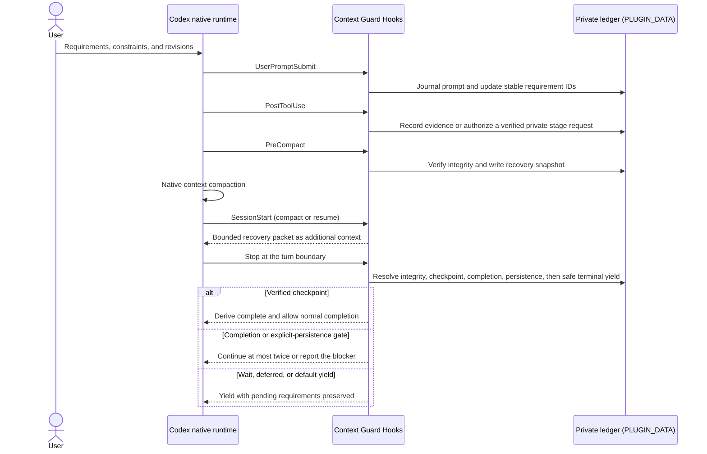

# Architecture

The authoritative continuation plan for the 0.9 protocol transition is
[Context Guard 0.9 development plan](DEVELOPMENT_PLAN_0.9.md); its protocol
rationale is [Protocol-authoritative completion](PROTOCOL_AUTHORITATIVE_COMPLETION.md).
That 0.9 transition shipped in the 0.9.x line; the current unreleased
`0.12.0` candidate advances the same model with enforcement profiles, an
explicit work-unit lifecycle (schema 10), Stop protocol 3.0.0, and silent
success paths. Sections marked *0.12 candidate* describe candidate behavior
that still requires release validation; unmarked sections describe the
published releases.

Context Guard is a correctness sidecar for Codex. It observes lifecycle events,
maintains private local task state, compiles a bounded recovery packet, and
gates completion claims against successful, contract-compatible evidence. It does not replace or
control Codex-native orchestration.

## Responsibility boundary

| Concern | Codex owns | Context Guard owns | Context Guard does not do |
| --- | --- | --- | --- |
| Conversation | transcript and compaction | pre-compact correctness snapshot and bounded recovery | copy the full transcript or rewrite the compact prompt |
| Planning | Plan mode and `update_plan` lifecycle | latest successful plan mirror as a read-only index | maintain a second editable plan |
| Goals | Goal lifecycle and UI | completion evidence for guarded task requirements | create, pause, or modify Goals |
| Memory | cross-task recall | task-local authoritative ledger | treat memory as requirement authority |
| Agents | spawning, messaging, waiting, permissions | delegated provenance and bounded result envelope | implement a scheduler, mailbox, or task lock |
| Worktrees | isolated file changes and Git state | bounded artifact/command evidence | synchronize or merge worktrees |
| Hooks | lifecycle event execution and trust | local state and completion policy | claim Hooks are a complete security boundary |

## End-to-end lifecycle

The arrows describe lifecycle observation and bounded context injection. Codex,
not Context Guard, performs compaction, controls the task lifecycle, and runs
tools or subagents. The private ledger never becomes a second transcript or
editable plan.

## Enforcement profiles (0.12 candidate)

`PreToolUse` and Stop behavior follow the active enforcement profile. Skill
text, repository instructions, plugin installation, or file presence can
suggest a profile but never enable one implicitly.

| Profile | How it becomes active | What it enforces | What it does not do |
| --- | --- | --- | --- |
| `standard` (default) | Skill selected normally or `context-guard on` | recovery, current-work-unit completion truthfulness, root-user authorization checks for real high-risk actions | no release readiness, candidate closure, or ticket requirements |
| `strict` | the user explicitly asks for strict evidence protection | `standard` plus enforced proofs for the current work unit | never implies the release profile |
| `release` | the user explicitly adopts a repository-release execution contract or declares the release profile | `standard` plus candidate-closure, publication-readiness, and one-shot `action-ticket/v1` facts through the versioned release adapter | never treats a tag, Release, or package publish as authorized by itself |
| `observe` | maintainer or canary configuration | computes the identical would-be decision and records aggregate diagnostics | never blocks; not for real high-risk publication |
| `off` / inactive | `context-guard off`, or no activation | prompt journaling only | no action or completion gating; corrupt private state cannot deny ordinary tools |

A denied action shows one bounded, actionable reason. An allowed action
returns the plain empty object with no text.

## Model- and agent-agnostic baseline (0.12 candidate)

0.12 does not assume that the model or agent host brings reliable long-context
protection or recovery of its own. Context Guard provides the whole loop
locally and deterministically — requirement recovery, work-unit lifecycle,
evidence binding, completion verification, and authorization — regardless of
which model or agent runtime consumes it.

Protocol semantics are separated from platform adapters:

- `scripts/cg_protocol.py` defines the model-agnostic event and record
  vocabulary: normalized sessions, tool calls, tool results, prompts, and
  lifecycle events.
- `scripts/cg_codex_adapter.py` owns the Codex-specific payload translation
  and is the only router-layer module that knows Codex wire names.
- The production router (`scripts/cg_hook.py`) consumes that adapter pair on
  the PreToolUse fast path. The heavy core still consumes the original Codex
  wire JSON directly for wire compatibility; routing the full core through
  the adapter is a later-phase target and is not current behavior.

Three named baselines are preserved for cross-product alignment with DSH
Completion Guard:

1. **requirement recovery** — authoritative requirements, acceptance items,
   and corrections survive compaction and resume without relying on
   conversational summaries;
2. **wrong completion** — a reply claiming whole-task completion while a
   deterministic obligation of the current work unit is unmet is stopped,
   with at most one visible correction per turn;
3. **wrong evidence binding** — evidence that does not match the required
   operation, subject, surface, scope, or adapter identity cannot close an
   item; identity comes only from bounded structured fields, and the same
   canonical input always yields the same matching result.

Alignment covers the failure families and their deterministic constraints,
not shared code. Context Guard does not guarantee arbitrary semantic
correctness: it enforces only the deterministic obligations it can express,
and it does not replace Codex's permission system, the `repository-release`
publication contract, human review, or platform readbacks.

## Source authority in an adopted 0.8.3 contract

Version 0.8.3 records instruction and evidence sources without treating the
last text seen as the winner. Their roles follow this order:

| Source | Role |
| --- | --- |
| System, sandbox, platform permissions, and Hook trust | Hard boundaries that lower sources cannot override. |
| Root-user instructions | Define the task, write authority, prohibitions, and later revisions. |
| Adopted repository `AGENTS.md` and Skills | Define workflow and safety constraints, but cannot expand user authority. |
| Codex Plan | Provides revisable execution steps; its mirror and optional binding are read-only. |
| Tool, file, image, UI, and public-readback evidence | Establishes current facts, but cannot create user authority. |

For example, a publishing Skill may require an image readback and public page
check. Adopting that Skill records which version supplies the workflow; it does
not authorize publication. A Codex Plan may schedule the image edit and page
check, but it cannot remove the user's prohibition on publishing. The returned
image and public page can prove facts only when they are bound to the requested
asset and output surface. If the adopted Skill or plan changes, 0.8.3 marks the
old binding for review. It does not intercept the next tool call because this
release has no `PreToolUse` Hook.

## Runtime state model

### L1: immutable task contract

Each prompt is stored in a private, immutable record with a content hash.
Metadata in the session state points to those records. Root human prompts can
create requirements, acceptance items, revisions, and control actions.
Delegated prompts are journaled with delegated authority and cannot create,
cancel, or supersede root requirements.

Supersession is append-only. A later instruction records which earlier item it
replaces; it does not rewrite the earlier record. Negated or ambiguous
supersession language fails closed and leaves the existing requirement active.
Before attribution, quoted spans, blockquotes, code, reply annotations,
attributed text, and system-added text are removed. Only an unquoted explicit
root-user correction with one unique target can supersede an existing item; the
runtime never falls back to “the previous requirement” when the target is
ambiguous.

### L2: bounded work state and evidence

Each non-control root-user prompt appends one `work-unit/v1` record. Completion
closes only the current unit and its descendants, while related ancestor
requirements remain constraints. A cleanup unit records its bounded purpose and
cannot silently transition into product repair, expanded validation, or remote
mutation.

The latest successful native `update_plan` call is mirrored into
`work_state.plan_snapshot`. Failed plan updates do not replace the last usable
snapshot. The mirror is recovery context only and never controls Codex Plan
mode.

Post-tool evidence records bounded input/output summaries, actor provenance,
outcome, outcome basis, detected subjects, asset IDs, and deterministic surface
capabilities. Structured success/failure is preferred.
Unstructured text and weak success markers are unknown. An exact standalone
completion marker can be successful only when the verification command itself
fails on unmet checks.

Binary and data-URL values are replaced with type, length, and SHA-256 metadata.
Generic typed text remains text; binary omission is based on field and container
semantics rather than a broad base64-looking heuristic.

Schema 6 also maintains a hash-only multimodal asset ledger. Hook payloads and
the bounded transcript tail contribute local-image or data-URL references. The
runtime reads bounded bytes only to calculate SHA-256, byte count, media type,
and dimensions; it stores no image bytes or full local locator. A later tool
event can bind evidence to the same asset hash or to a distinct result-readback
asset.

Late attachment discovery is incremental rather than a per-tool transcript
rescan. A readable transcript is inspected at most once for each pending human
prompt during `PostToolUse`; `PreCompact` and compact/resume `SessionStart`
remain forced recovery opportunities. Only prompt IDs and bounded scan state
are persisted.

Schema 9 retains that completion and proof ledger, accepts schema 7 and 8 only
as read-only migration inputs, and adds append-only work units plus active
release-action ticket state. It also keeps storage for adopted project
instructions and execution plans. Until the root user explicitly adopts
a deterministic, project-relative manifest, that storage does not affect the
task. It keeps bounded instruction-source metadata, contract hashes, phase/gate
state, authorization candidates, drift markers, exact-host coverage, ticket
namespaces, unified-exec sessions, and delegated actor bindings. Natural-language
candidates cannot activate a contract or grant authority. Optional native-plan
binding compares semantic digests and marks changed bindings for review; the
plan mirror remains read-only.

### L2.1: synchronous pre-action authorization

`PreToolUse` classifies covered mutations into three tiers under the active
enforcement profile. In the `release` profile, A-tier release identity
changes (release-tag creation or push, registry publish/yank, and
GitHub Release create/update/delete/upload) require one exact, unexpired
`action-ticket/v1`. The ticket binds repository, commit, tag/version,
`candidate-closure/v1`, passing publication `release-readiness/v3` or explicit
legacy `v2`, normalized tool input, contract revision, authorization source,
and expiry. Unknown readiness schemas fail closed. The ticket is reserved for
one tool-use identity, consumed after success, returned to reserved only after
a failed identical call, and invalidated by candidate or contract drift.

B-tier ordinary remote push, force-push, and remote-branch deletion requires
the latest root-user prompt to name both the action and exact remote/ref target;
quoted or attributed text and delegated authority do not count. C-tier local
edits, tests, ordinary commits, and proven-redundant local worktree cleanup are
not hard-gated. A cleanup work unit still denies a product edit until a separate
root-user work unit authorizes it.

In the `standard` and `strict` profiles, covered high-risk actions are checked
only against current root-user semantic authorization inside the active work
unit; release-readiness and ticket facts are never consulted there. The
`observe` profile computes the identical decision and records it without
blocking, and `off` or inactive sessions gate nothing at all. The classifier
resolves real executable positions and effects: command words inside echo,
search, quoted, or documentation text are never actions, and `--dry-run`
or read-only forms are simulation or read-only classes that consume neither
authorization nor tickets.

This Hook is a strong guardrail rather than a complete security boundary.
Platform approvals remain authoritative, and specialized tools that do not
emit Codex Hook events remain listed coverage gaps.

### L3: delegated-agent provenance

`SubagentStart` records a bounded delegated contract and injects the root
authority boundary. `SubagentStop` stores a bounded result summary and checks for
the result envelope fields `Outcome`, `Evidence`, `Validation`, `Limitations`,
and `Next`.

The plugin does not read or copy the delegated agent transcript or hidden
reasoning. A delegation wrapper is accepted as delegated only when runtime
metadata or a currently running agent corroborates it.

### L4: recovery and completion verification

`PreCompact` validates state integrity, saves an atomic recovery snapshot, and
fails closed when the correctness state cannot be trusted. `SessionStart` on
compact/resume restores a bounded packet in this priority order:

1. active requirements and acceptance items;
2. explicit supersessions;
3. latest native-plan mirror;
4. active and recent bounded agent state;
5. recent successful/failed evidence;
6. bounded asset metadata and unresolved proof obligations; and
7. completion rules.

The packet uses a reserved suffix budget: lower-priority sections may be
clipped, but the completion rule cannot be displaced by contract or asset
metadata.

The completion gate is bound to the current turn. Only successful evidence
already captured by the Hook may satisfy a requirement or acceptance item.
Private staging remains in plugin data and is never appended to the visible
assistant response.

### Stop protocol 3.0.0 (0.12 candidate)

The 0.9 protocol-authoritative completion change described below was
implemented in the 0.9.x line, and 0.11.0 advanced it to Stop protocol
2.1.0. The unreleased 0.12.0 candidate advances it to Stop protocol 3.0.0:

- Stop derives intent from the final reply plus the current work unit's
  structured state. Ordinary endings need no commands: when the reply shows a
  verifiable whole completion and the unit holds exactly one determinable
  successful evidence match, the guard binds it and closes the unit itself;
  waiting, external-wait, and deferred boundaries are normalized from
  structured facts and end silently.
- Evidence that is not unique is never auto-selected: the obligation stays
  pending, and only an explicit whole-completion claim can trigger one
  Stop correction that asks for explicit selection or a registered proof.
- The waiting-owner ladder reads only structured facts (authorized assistant
  actions, missing user input, registered external waits, explicit deferrals);
  natural-language classification stays diagnostic and cannot override it.
- Each turn carries a `visible_interruption_budget` of one. A second
  unmet correction ends the turn safely with pending work preserved and
  diagnostics recorded. PreToolUse hard denies of real unauthorized
  high-risk actions are exempt from this budget.
- Default Stop feedback is capped at 240 characters and is anonymous by
  contract: the current unit's pending-item count, one reason, and one next
  step. Detailed IDs and reason codes appear only in `context-guard
  diagnose` or explicit `--full` audits.
- Work-unit lifecycle (schema 10): `active`, `completed`, `awaiting_user`,
  `awaiting_external`, `deferred`, `historical_unresolved`. Migrations
  isolate old active parent chains as `historical_unresolved` — they are
  never silently marked passed — and only a unique explicit resume intent
  reopens a waiting unit.

The protocol history below describes the shipped 0.9.x and 2.1.0 behavior
for released versions and remains the baseline that released runtimes
implement.

Proof protocol 1.0.0 derives only deterministic contracts from immutable prompt
signals. Its obligation types cover input-asset inspection, distinct visual
result readback, named path/URL subject readback, and complete-scope coverage.
Complete-scope wording first becomes a candidate; enforcement requires a
prompt-derived expected cardinality or an exact multi-object set and digest.
Qualitative uses such as “完整介绍” or “summarize all changes” abstain to
`legacy_fallback` instead of fabricating an enumerable scope.
An `enforced` contract cannot be weakened after creation. When an attachment or
contract boundary cannot be established, the item is explicitly
`legacy_fallback` and uses the compatible 0.6.3 evidence gate.

`register-proof` authenticates the current session, turn, and private token,
then stores an immutable item/obligation/evidence binding. It rejects failed or
stale evidence, incompatible tool capabilities, wrong subjects/surfaces,
same-image result readbacks, unresolved visual facts, and observed scope sets
that omit any normalized expected identifier. Scope counts and digests are
computed by the runtime rather than accepted as caller claims, and the proof's
expected set must match the prompt-derived cardinality/digest.

Schema 6 retains the schema-5 completion attempt and gives each active attempt one `staged_control` slot. It is
either a verified checkpoint or one typed non-completion disposition:
`continue`, `user_wait`, `external_wait`, or `deferred`. `complete` is not a
disposition; it can be derived only when Stop validates and consumes a
checkpoint covering every non-superseded requirement and acceptance item.
Staging the same control is idempotent, a different control conflicts, and an
intentional change requires `--replace`.

Stop protocol 2.1.0 treats terminal controls as a protocol-authoritative safety lattice.
`user_wait`, `external_wait`, and `deferred` describe safe handoff boundaries.
The legacy `continue` value remains accepted for protocol compatibility but is
advisory only: assistant work continues through tool calls before a terminal
reply, not by forcing a retry after that reply already exists.

The private `stage-checkpoint` and `stage-disposition` CLI commands are
prechecks, not state-writing authorities. `PostToolUse` is the authoritative
staging path: it verifies the exact command, expected data directory, session,
turn, token hash, and output marker before storing the single control. A
structured tool response must report success. When Code Mode provides only raw
stdout, the successful precheck emits the expected marker followed by a final
standalone `Script completed` receipt. The marker alone is not success;
structured failure, an explicit nonzero exit status, or hard failure text takes
priority over the receipt. A request observed only in assistant text, tool
input, or an unsuccessful/unmatched tool result cannot stage anything, and no
control command is recorded as requirement-closing evidence.

Stop protocol 2.1.0 applies this fixed priority:

1. private-state and prompt-boundary integrity are verified first;
2. leaked private checkpoint/disposition metadata fails closed;
3. a staged control is authenticated and structurally validated; malformed,
   stale, replayed, or conflicting control fails closed;
4. a complete hash-verified checkpoint is consumed as `complete`, while a
   partial or invalid checkpoint blocks;
5. explicit user persistence blocks a terminal yield unless the next priority
   establishes a genuine unavailable boundary;
6. `user_wait`, `external_wait`, and `deferred` yield only when their declared
   owner, authorization, and dependency type agrees with the observed facts;
   an assistant declaration cannot erase authorized remaining work or a
   high-risk drift; and
7. legacy `continue`, no staged control, or a terminal-control mismatch yields
   safely and leaves every unresolved requirement pending.

Rejected control and explicit-persistence corrections are capped at two turns.
Classifier 2.3.2 records the observed natural-language outcome, action facts,
and anomalies for diagnosis only. No completion wording, classifier result, or
inferred action ownership can change the protocol outcome, pending state, or
continuation count. `protocol_default` and `protocol_user_persistence` identify
the new authoritative paths; `nlp_hard_gate` remains readable only in legacy
decision history. Classification still reads the full hash-verified prompt
record, and an ambiguous prompt boundary remains an integrity failure.

## Hook lifecycle

| Event | Purpose | Visible context |
| --- | --- | --- |
| `UserPromptSubmit` | journal prompt, classify authority, capture prompt assets, and update requirements/contracts/revisions | activation/status and bounded completion instructions |
| `PreToolUse` | classify actions under the active profile, deny unauthorized real high-risk mutations (release-profile tickets for A-tier identities), and prevent cleanup-to-product-edit transitions | one bounded deny reason; an allow returns no text |
| `PostToolUse` | record bounded evidence/assets/capabilities, observe successful `update_plan`, and authoritatively stage a verified private control request | none — success paths return the empty object |
| `PreCompact` | validate state and write recovery snapshot | continue/fail-closed result |
| `SessionStart` | restore bounded context on compact/resume | recovery packet |
| `SubagentStart` | record delegated lifecycle and inject contract | bounded delegated contract |
| `SubagentStop` | record bounded result envelope | warnings only when needed |
| `Stop` | apply work-unit completion truthfulness, waiting-owner facts, integrity, and one-visible-interruption priority | correction only for verified hard gates, at most once per turn |
| `SessionEnd` | mark session ended, write final recovery, run retention cleanup | none |

Normal success paths are invisible: the nine Hook definitions carry no
persistent `statusMessage`, every allow path returns the plain empty object
with no developer receipt, and the private staging and proof receipts do not
enter the visible event stream. Errors, integrity failures, and real
unauthorized high-risk denies remain visible. Under the official Codex matcher
contract — a regex applied to the tool name and its aliases — the
`PreToolUse` matcher is shrunk from `"*"` to exactly the surfaces the
classifier can gate: the Bash shell/unified-exec alias, `apply_patch` with
its `Edit`/`Write` aliases (the hook input still reports `apply_patch`), every
`mcp__` name so near-miss or case-variant mutation methods cannot bypass, and
the bare mutation-method function names. The required matcher is derived from
the live classifier constants and pinned by a contract test, so the two can
never drift. `PostToolUse` keeps the match-everything wire for broad evidence
collection and stays silent on allow.

## Private state

Schema 10 adds the explicit work-unit lifecycle on top of the prior task,
evidence, proof, and completion fields, plus:

- work-unit states (`active`, `completed`, `awaiting_user`,
  `awaiting_external`, `deferred`, `historical_unresolved`) with parentage,
  prompt bindings, and the persisted `last_active_seq` used for unique
  explicit resume; and
- bounded instruction-source metadata and canonical contract digests;
- contract, phase, gate, authorization-candidate, drift, and exact-host
  coverage records;
- `work-unit/v1` parentage and prompt bindings; active `action-ticket/v1`
  identities, candidate-closure/readiness/input digests, lifecycle state, and
  expiry; unified-exec session metadata; and delegated actor bindings; and
- optional semantic native-plan binding with stale-state propagation.

The retained schema-6 task ledger contains:

- session identity and lifecycle timestamps;
- prompt metadata and immutable prompt records;
- requirements, acceptance items, and supersessions;
- evidence with monotonic IDs and bounded retention;
- a hash-only multimodal asset ledger with source type, redacted reference,
  SHA-256, byte count, media type, dimensions, and availability;
- immutable per-item verification contracts plus Proof protocol bindings,
  visual facts, distinct result readbacks, and normalized scope digests;
- `work_state.plan_snapshot`;
- bounded agent records;
- compaction history;
- one turn-bound completion attempt with protocol version, token hash, staging
  timestamp, and a single checkpoint-or-disposition `staged_control`;
- a checkpoint-derived completion record;
- at most 32 hash-only Stop decision records with protocol/classifier versions,
  decision source, disposition and outcome enums, bounded reason/action enums,
  prompt/reply SHA-256, and no raw reply text;
- integrity status and a canonical content hash.

Default checkpoint status is scoped to the current work unit and its
descendants and preserves ancestor requirements as constraints. Explicit
`--full` and `--item` modes provide audit detail; a repeated revision returns a
constant-size unchanged receipt. Writes are atomic. Session operations use a cross-platform lock. State is
validated before use; corrupted state is preserved for diagnosis and rebuilt
only from hash-verified prompt records. Reconstructed requirements return to
pending because prior evidence cannot be silently re-trusted. Schema 1, 2, 3,
and 4 migrate through schema 5 and schema 6 to schema 9 while preserving the
durable ledger. Schema 7 and schema 8 are read-only compatible inputs.
Existing schema-5 items are marked `legacy_fallback`; migration never invents
retroactive proof obligations. Migration
deliberately discards any in-flight completion attempt, token, or staged control
so a stale turn cannot authorize the new protocol.

## Historical Hook cache lifecycle

The installer archives immutable version trees under
`CODEX_HOME/plugins/cache-archive/codex-context-guard/context-guard/<version>`
and stores their SHA-256 manifests in an atomic trusted index. It archives live
versions before invoking Codex, restores deleted historical live caches after
installation, and archives the newly installed version after parity succeeds.
Read-only runs audit only; `--apply` repairs a live cache only from a valid
archive. Missing or corrupt archive evidence fails closed, and no archive is
auto-pruned.

Product manifests intentionally exclude runtime artifacts such as
`__pycache__` and `.pyc`, but that exclusion does not authorize their deletion.
Before a destructive Codex cache refresh, the 0.8.7 installer compares every
indexed historical live tree with its trusted archive using a separate all-file
SHA-256 view. A differing historical tree is copied into a transaction bundle
outside the replaceable cache root. After refresh, the exact live tree is
restored and verified; the bundle is removed only after success. A pending
bundle is read-only evidence of an interrupted transaction: non-apply diagnosis
fails without writing, while the next managed `--apply` restores it first.
The bundle never becomes archive trust authority, and embedded Git metadata,
symlinks, malformed paths, or invalid hashes fail closed.

A managed apply is not the only actor in this hierarchy. An observed macOS
Codex CLI 0.149.0 host prunes historical versioned live caches when a fresh
task starts and keeps only the registered current version. Open tasks still
reference their trusted versioned path, so a pruned tree breaks their later
Hook invocations even though the trusted archive stays intact. The installer
cannot observe this cleanup while it happens: read-only diagnosis names it
explicitly, and a managed `--apply` restores the exact trees from the archive.

Because an already-open task cannot be told to trust new Hook command bytes,
the 0.8.11 commands carry their own resolution policy: prefer the pinned
`$PLUGIN_ROOT` tree; when it is missing, resolve the newest surviving strictly
semver-named (`X.Y.Z`, exactly three dot-separated numeric components, no
leading zeros), non-symlink Context Guard tree under the managed marketplace
cache root (`CODEX_HOME` when set, otherwise `~/.codex`); otherwise exit 2
with the actionable reinstall hint. The consumed 0.8.10 candidate introduced
the fallback with a looser version gate that is now superseded; its installed
cache bytes remain immutable. The fallback executes only host-
materialized product trees inside that root. It may run a newer runtime than
the one a rescued task originally trusted; consumed caches stay immutable, and
only the trusted archive can restore exact historical bytes.

## Exports and successor packs

`export` produces a redacted project-bounded handoff. `rollover` additionally
requires a user-prepared input, validates file paths and hashes, enforces byte
and file limits, and writes to a new non-overwriting directory. Neither action
creates, activates, retires, or grants authority to a task.

## Maintenance boundary

The 0.6.x line is limited to the schema-5 private turn-control protocol,
diagnostics, compatible cache lifecycle, correctness/security, tests, and
documentation. It does not add a Hook event, matcher, or Codex Hook payload
field; the existing eight-event `hooks.json` wire contract remains compatible.
The unreleased 0.6.0 candidate established this boundary but failed a real Code
Mode raw-stdout fresh gate because its marker-only response was correctly
classified as unknown. Version 0.6.1 changes only the successful private-stage
receipt; state schema 5, Stop protocol 1.0.0, classifier 2.0.0, dispositions,
Stop priority, and all eight Hooks remain unchanged. The installed 0.6.0 cache
is immutable and must not be patched in place or tagged.

The 0.7.x line adds schema 6 and deterministic Proof protocol 1.x while keeping
Stop protocol 1.1.0 and the eight-event Hook wire. Versions 0.7.4, 0.7.5, and
0.7.6 refine completion assertions and future-action binding; 0.7.7 advances
classifier metadata to 2.2.1 while correcting subject, UI-surface, and
structured visual-result classification. None changes the schema or Hook
surface. It
guarantees only displayed `enforced` obligations and does not claim arbitrary
pixel understanding or semantic completeness for `legacy_fallback` items.

The 0.8.x line introduces schema 7 and execution protocol 1.0.0. Version 0.8.3
is the first completed contract-adoption release. It remains on the existing
eight-event Hook wire and adds no `PreToolUse`, tool interception, automatic
ticket reservation, commit/publish action, or authority for uncovered
surfaces.
